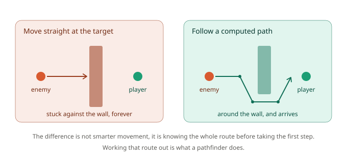
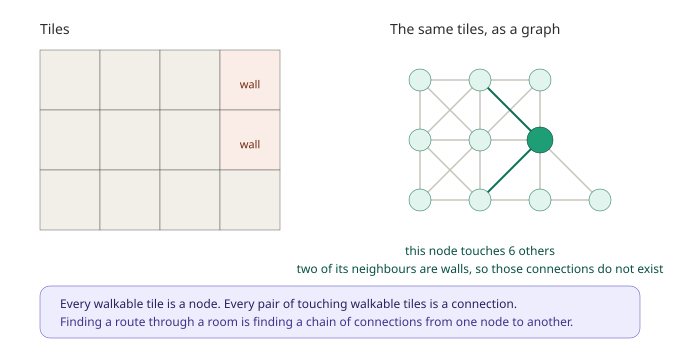
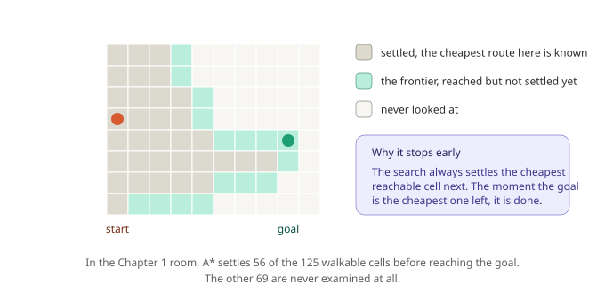

# Chapter 1: What Is Pathfinding, Anyway?

Welcome to GMNav! Before writing a single line of code, it's worth spending a few minutes on a question that sounds simple but has a surprisingly interesting answer: what does a pathfinder actually *do*, and why does your game need one instead of just moving an enemy toward the player a few pixels at a time?

This chapter is deliberately gentle. If you've never built or used a navigation system before, you're in exactly the right place. By the end, you'll have a working navigation grid built from a real dungeon room, a real path across it, and that path drawn on your screen so you can see what the framework decided and why.

## The problem: getting from here to there

Imagine a guard in a dungeon who has spotted the player and wants to reach them.

The most obvious approach: every step, work out which direction the player is in, and move that way. In GameMaker, that's a `point_direction` call, an `lengthdir_x`, and you're done in three lines. No framework needed.

For an empty room, that's... probably fine, honestly. It works, it looks reasonable, and it costs nothing.

But rooms have walls in them. Here's what happens the moment one gets between the guard and the player:



The guard walks into the wall and stays there, pressing helplessly against it, because "the player is that way" remains true the entire time. Nothing about the situation ever changes, so nothing about the guard's behaviour ever changes either.

You can patch around this. Slide along walls when you hit them. Pick a random direction and try again. Add waypoints by hand and hope the level never changes. Every GameMaker developer has written at least one of these, and they all share the same weakness: the guard is making decisions using only what it can feel right now, at the point of its own nose. It has no idea what the room looks like.

The fix isn't smarter local movement. It's working out the entire route *before* taking the first step.

## The idea: the room is a network

Here's the shift in thinking that everything else rests on. Stop picturing a room as an image, and start picturing it as a network of places connected to other places.

Think about a metro map. It doesn't tell you the real shape of the city, how far apart the stations are, or which direction the tunnels curve. It tells you one thing: which stations connect to which other stations. That's enough to plan a journey. You trace a chain of connections from where you are to where you want to be, and you have your route.

A navigation grid is exactly that, built automatically from your tiles. This structure has a name, a **graph**, and its pieces have names too. Each place is a **node**. Each connection between two places is an **edge**.



Look at the highlighted node on the right. It connects to seven others, not eight, because one of its neighbours is a wall, so that connection simply doesn't exist. That's the whole trick of how walls work in a pathfinder. You never write code that says "avoid walls". Walls are places the graph doesn't reach, and a route made of real connections can't pass through one because there's nothing there to travel along.

So finding a path is finding a chain of edges from the start node to the goal node. That's it. That's the problem.

## Searching without checking everything

There's usually more than one chain of edges that gets you there, and we want a good one. So how does a pathfinder find it?

The obvious idea, try every possible route and keep the shortest, is hopeless. In a room of any size the number of possible routes is astronomically large. Instead, a search algorithm does something much cleverer, and it's worth understanding because it explains everything you'll see later.

It spreads outward from the start, always settling the cheapest cell it has reached so far. "Settling" a cell means committing to it: the search has now proved that the route it found to that cell is the cheapest possible one, and it will never need to revisit it. As it settles cells, it discovers their neighbours, and those neighbours join a growing pool of cells that have been reached but not yet settled. That pool is called the **frontier**.



The important consequence is at the bottom of that diagram. Because the search always settles the cheapest cell available, the instant the *goal* becomes the cheapest cell available, the search is finished, and it stops. In our dungeon room, that happens after settling **56 cells out of 125 walkable ones**. The other 69 are never looked at, not once.

The algorithm GMNav uses for this is called **A\*** (pronounced "A star"), and it has one more refinement that we'll unpack properly in Chapter 2: it biases its exploration toward the goal, so it settles far fewer cells than it otherwise would. For now, the mental picture of an expanding, cost-ordered frontier is exactly right, and it's the picture you'll want in your head for the rest of the series.

## Setting up your first grid

Every GMNav project starts the same way: describe the shape of your world, build a grid, tell it where the walls are. Let's do exactly that.

### Step 1: Describe the shape of the world

```gml
layout = gmnav_layout_create(gmnav_layout.ORTHO, 32, 32);
```

A **layout** describes how cells map onto the screen. Here we're saying: a plain square grid (`ORTHO`), with tiles 32 pixels wide and 32 pixels tall.

This is a separate object from the grid itself for a reason that will pay off in Chapter 5, GMNav also supports isometric and hexagonal maps, and swapping the layout is genuinely all it takes to move between them. The search code never changes. For now, `ORTHO` is what you want.

### Step 2: Build the grid

```gml
grid = gmnav_grid_create(16, 12, layout);
```

That's a grid 16 cells across and 12 cells down, using the layout we just made. At 32 pixels per tile, that's a room 512 by 384 pixels.

Every cell starts out walkable. Nothing is blocked until you say so.

### Step 3: Tell it where the walls are

GMNav doesn't guess at your collision. You tell it, and there are three ways to do that.

The direct way, one rectangle at a time:

```gml
gmnav_grid_fill_blocked(grid, 8, 1, 8, 7, true);   // a wall down column 8
gmnav_grid_set_blocked(grid, 4, 4, true);          // a single cell
```

The way you'll actually use in a real project, straight from a tilemap layer:

```gml
gmnav_grid_import_tilemap(grid, layer_tilemap_get_id("Tiles_Collision"));
```

By default, any non-empty tile counts as a wall. If your collision layer is more nuanced than that, pass a function that decides:

```gml
gmnav_grid_import_tilemap(grid, my_tilemap, function(_tile) {
    return (_tile == 1 || _tile == 7);   // only these tile indices block
});
```

For this chapter we're using a small dungeon room: solid outer walls, a dividing wall down the middle with a doorway near the bottom, and two pillars. 125 of its 192 cells are walkable. The full map is in `Chapter1_Dataset.gml`, and setting it up is one call:

```gml
var _map = chapter1_get_map();

layout = gmnav_layout_create(gmnav_layout.ORTHO, _map.tile, _map.tile);
grid   = gmnav_grid_create(_map.width, _map.height, layout);

chapter1_apply_walls(grid);
```

**A note on why the room has a doorway near the bottom.** It isn't decoration. The start and goal in this chapter both sit near the top of the room, on opposite sides of the dividing wall, so the only route between them runs all the way down, through the gap, and back up again. A room where the answer is a straight line teaches you nothing about pathfinding.

## Your first path

Cells are identified by a **node ID**, a single integer, rather than a column and row pair. You'll be converting between the two constantly, so both directions have a function:

```gml
var _start = gmnav_grid_node(grid, 2, 2);          // from column and row
var _goal  = gmnav_grid_node(grid, 13, 2);

var _here  = gmnav_grid_world_to_node(grid, x, y); // from world coordinates
```

Now the search itself. A search is an object you create once and reuse, not a function that returns a path:

```gml
search = gmnav_search_create(grid);

gmnav_search_begin(search, _start, _goal);
var _state = gmnav_search_step(search, 100000);

if (_state == gmnav_state.FOUND) {
    var _path = gmnav_search_get_path(search);
    show_debug_message("Path found, " + string(array_length(_path)) + " cells");
}
```

That two-step shape, `begin` then `step`, is not an accident and it isn't boilerplate. It's the single most important design decision in GMNav, and Chapter 3 is entirely about why. The large number we're passing as a budget here means "just finish it, don't stop partway", which is fine while learning and something you'll stop doing once you understand what it costs.

Run it against our dungeon room and you get:

```
Path found, 17 cells
  (2,2) (3,3) (3,4) (3,5) (3,6) (4,7) (5,8) (6,8) (7,8) (8,8) (9,8) (9,7) (9,6) (10,5) (11,4) (12,3) (13,2)
```

Take a moment to actually look at this, because there's real teaching value hiding in it.

**The path immediately heads downward, away from the goal.** The goal is at row 2, straight across to the right. The very first move goes to row 3, and it keeps descending to row 8 before it turns. That looks wrong at a glance and is completely correct: the doorway is down there, and there is no other way through. This is the difference between a pathfinder and a guard that walks at you. The pathfinder is willing to move *away* from its target in the short term because it has already worked out that doing so is the only way to eventually arrive.

**It hugs the pillars diagonally rather than turning square corners.** Look at the run from (9,8) up to (13,2): it steps diagonally almost the whole way. GMNav allows diagonal movement by default and prices it correctly, so a diagonal step is preferred whenever it genuinely saves distance. Chapter 2 covers exactly how that pricing works.

**The path is 17 cells but the straight line is 11.** In world units the route is 604.78 pixels long, against 352 pixels as the crow flies. That gap is the wall, measured. It's also a useful sanity check in your own levels, if a path comes back dramatically longer than the direct distance, something in your map is forcing a detour, and it may not be the something you intended.

## Seeing it

Reading node IDs out of a debug log is a miserable way to understand a navigation system, so GMNav ships a debug renderer. This is the one part of this chapter you should genuinely go and run, because from here to the end of the series, every concept can be looked at instead of imagined.

Two lines in a Draw event:

```gml
gmnav_debug_draw_grid(grid);
gmnav_debug_draw_path(grid, gmnav_search_get_path(search));
```

The first fills every blocked cell so you can confirm GMNav's idea of your world matches your own. The second draws the path over it.

That first call is worth more than it looks. A surprising share of "the pathfinder is broken" turns out to be "the pathfinder is working perfectly on a map that isn't the one on screen", usually an import that read the wrong tilemap layer, or an off-by-one in the grid dimensions. Draw the grid once when you set up a level, and you'll never spend an evening on that particular bug.

## When there's no way through

Not every request can be satisfied, and your code needs to handle that. Block the doorway and try again:

```gml
gmnav_grid_fill_blocked(grid, 8, 8, 8, 10, true);   // seal the gap

var _s2 = gmnav_search_create(grid);
gmnav_search_begin(_s2, _start, _goal);

if (gmnav_search_step(_s2, 100000) == gmnav_state.FAILED) {
    show_debug_message("No route exists.");
}
```

This prints `No route exists`, and it does so only after the search has exhausted every reachable cell, 66 settled cells this time rather than 56, because proving a route *doesn't* exist means genuinely looking everywhere it could have been.

There are two distinct ways a request can come back without a path, and telling them apart matters:

| Result | What it means |
|---|---|
| `gmnav_state.FAILED` | The goal is genuinely unreachable, or blocked, or invalid. Don't retry, nothing will change. |
| `gmnav_state.IDLE` after `begin` returns `false` | GMNav had no free workspace to run the search in. Try again shortly. |

That second case can't happen yet with a single search, but it becomes important in Chapter 3. The habit worth building now is to check the returned state rather than assuming a path arrived.

## No cleanup required

If you've used GameMaker's data structures, you'll be waiting for the part where you destroy everything you created. There isn't one.

Every GMNav object, grids, layouts, searches, paths, is a plain struct. GameMaker's garbage collector reclaims them when nothing references them any more, the same way it handles arrays. Drop the variable, and the memory goes.

The one thing worth knowing is that a grid isn't small. It holds several arrays sized to your cell count, plus reusable workspaces for searches to run in. On a 500 by 500 map that's real memory, so build one grid per level and share it, rather than building one per enemy.

## What you've learned

Let's recap, because this chapter covered more conceptual ground than it might have felt like:

- **Why pathfinding exists**: moving toward a target using only what's directly in front of you fails the moment a wall is in the way, and no amount of local patching fixes it properly.
- **The graph**: a room is a network of nodes (walkable cells) joined by edges (connections between touching cells). Walls aren't obstacles to avoid, they're places the graph doesn't reach.
- **How a search works**: it spreads outward from the start, always settling the cheapest reachable cell, and stops the moment the goal is the cheapest one left, which is why it can ignore most of the map.
- **The practical basics**: `gmnav_layout_create` to describe the world's shape, `gmnav_grid_create` to build it, an importer to place the walls, `gmnav_search_begin` and `gmnav_search_step` to find a route.
- **Reading a path critically**: a route that heads away from the goal, or comes back much longer than the direct distance, is usually correct and always informative.
- **Seeing instead of guessing**: `gmnav_debug_draw_grid` and `gmnav_debug_draw_path` turn an abstract structure into something you can check with your eyes.

## What's next

Right now, every step in our path costs the same as every other step, and GMNav is choosing between routes using rules we haven't examined at all. Why did it prefer that particular chain of diagonals? What exactly is it comparing? And what happens when some ground is genuinely harder to cross than other ground, mud, water, a road that should be preferred?

In **Chapter 2**, we'll open up the decision. You'll learn what "cost so far" and "estimated cost remaining" mean and how A\* combines them, why diagonal steps have to cost more than cardinal ones, what makes an estimate safe to use and what silently breaks when it isn't, and how to make terrain expensive so your paths flow around a swamp instead of straight through it.

See you there.
