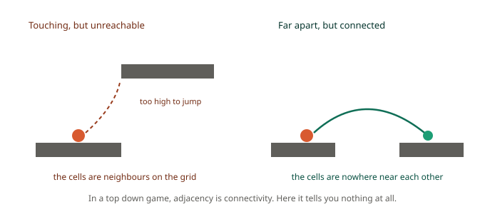
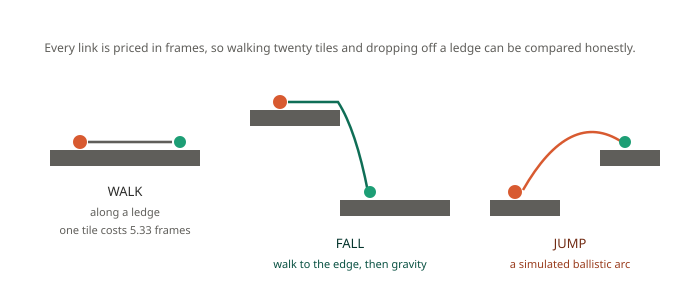
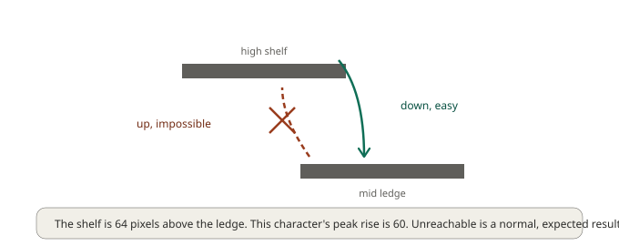
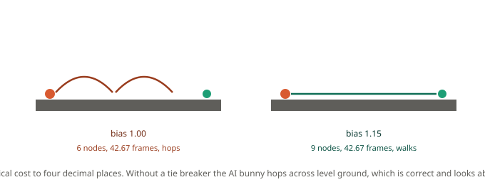

# Chapter 10: Navigating a Platformer, Simulated Jump Arcs

Every chapter so far has rested on one assumption, quietly, without ever stating it: **cells connect to their neighbours because they are next to each other.**

Turn the camera sideways and that assumption is simply false.



Two ledges can be touching on screen and completely unreachable from one another, because one is above the other and your character can't jump that high. Two ledges can be nowhere near each other and connected perfectly well, because your character can clear the distance between them.

Adjacency has nothing to do with it. **Connectivity is a property of how your character moves**, and that means the pathfinder has to know how your character moves.

This is the last chapter and the hardest one. Take your time with it.

## The idea

GMNav doesn't guess at platformer connectivity, and it doesn't ask you to hand-place jump markers. It works the graph out by **simulating your character's actual jump arcs against your actual collision data**.

Three steps:

1. Find every place a character could stand.
2. From each of those, simulate every movement it could make, walking off the edge, jumping at various strengths, in each direction.
3. Wherever an arc lands on another standing place, record a link, and price it in frames.

The result is a directed graph of ledges. Not a grid. A\* then runs on that graph exactly as it has all series.

## Describing how your character moves

Everything depends on this struct, so it deserves care:

```gml
move = gmnav_movement_create(
    0.5,   // gravity per frame
    8,     // jump velocity at full strength, positive
    3,     // run speed
    9,     // terminal fall speed
    12,    // character width
    24,    // character height
    undefined,   // air speed, defaults to run speed
    3      // how many jump strengths to sample
);
```

> ⚠️ **These must be your player controller's real numbers.**
>
> Not approximations, not round figures that seem about right. If `jump_vel` is even slightly generous, the graph will contain links your character physically cannot traverse, and an agent will walk to a ledge, jump, miss, land, walk back, and try again forever. This is the single most likely source of trouble in the entire framework.

You can compute the consequence yourself and check it against your game. Integrating that model gives a peak rise of exactly **60.00 pixels**, which on 16 pixel tiles is 3.75 tiles. If your character in-game clears four tiles, your numbers are wrong.

**The integration order matters too.** GMNav applies gravity, clamps to terminal velocity, moves horizontally, then moves vertically, which is the order almost every GameMaker platformer controller uses. If yours differs, arcs will drift from reality by a pixel or two per frame, which is invisible on short hops and lands long jumps in the wrong place.

## The level

44 by 34 cells at 16 pixels. Ground floor with a four-tile gap and a ten-tile chasm, a low ledge, a mid ledge, and a high shelf.

```gml
grid  = chapter10_build();
move  = chapter10_movement();

graph = gmnav_platgraph_create(grid, move);
gmnav_platgraph_bake(graph);
```

The bake finds **90 standing positions** and generates **561 links**: 166 walks, 19 falls, 376 jumps.

### Where standing positions come from

A cell is a standing position when three things hold: the cell is open, the cell below it is solid, and the character's whole box fits there without clipping anything.

That last condition catches something that surprised me while building this chapter's level. My first draft put a ledge two tiles above the floor, and the level silently split in two, because a 24 pixel character couldn't walk *underneath* the ledge. Those floor cells weren't standing positions at all.

That's correct behaviour and it's also a level design constraint you now know about: **a platform needs enough headroom beneath it for anything that walks under it.**

## Three kinds of connection



**WALK** links join horizontally adjacent standing cells. One tile at run speed 3 on 16 pixel tiles costs 16/3 = 5.33 frames.

**FALL** links begin with the character walking to the edge, then gravity taking over. There's a detail here worth knowing: a fall cannot simply start with gravity, because on frame one the character is still standing on solid ground and would immediately register as having landed. GMNav walks it to the edge first, counting those frames into the cost, and only then begins the arc.

**JUMP** links are ballistic arcs, simulated at several strengths in each direction. `jump_levels = 3` samples half strength, three-quarter, and full, which is what a game with variable jump height needs. If your character has a single fixed jump, set it to 1 and cut the bake cost by two thirds.

**Everything is priced in frames**, not distance. That's what lets the search compare "walk twenty tiles around" against "drop off this ledge" honestly. Measured in distance, a forty pixel drop would look expensive when it actually costs eight frames, and agents would take absurd detours to avoid falling.

## Reading a path

```gml
var _from = gmnav_platgraph_node_at(graph, x, y);
var _to   = gmnav_platgraph_node_at(graph, target_x, target_y);

ticket = gmnav_scheduler_request(psched, _from, _to);
```

`gmnav_platgraph_node_at` searches downward, so it works while the character is airborne too, finding the ledge below it.

When the ticket resolves you get **two** arrays:

```gml
var _path  = gmnav_scheduler_get_path(ticket);
var _links = gmnav_scheduler_get_links(ticket);
```

`_links[i]` is how you reach `_path[i]`. Here's the actual descent from the high shelf to the mid ledge, 133.97 frames:

```
 0  (22,16)  start
 1  (21,16)  WALK
 2  (20,16)  WALK
 3  (19,16)  WALK
 4  (18,16)  WALK
 5  (11,23)  JUMP
 6  (16,23)  JUMP
 7  (17,23)  WALK
 8  (21,20)  JUMP
 9  (22,20)  WALK
```

It walks to the shelf edge, jumps down to the ground floor, crosses the four-tile gap with a second jump, walks a step, and jumps up onto the mid ledge. Nine moves, three of them jumps, each one something your character controller has to actually perform.

## Executing links is your job

This is the boundary, and it's deliberate.

**GMNav tells you a jump is needed and where it lands. It does not press the jump button.**

Variable jump height, coyote time, input buffering, air control and animation states all differ per project, and a library that guessed at them would be wrong for everyone. This is the same division of labour Recast and Detour use for off-mesh links in 3D engines.

So the shape of your agent code is roughly:

```gml
var _next = _path[seek];
var _how  = _links[seek];

switch (_how) {
    case gmnav_link.WALK:
        // run toward the next node's x
        break;

    case gmnav_link.FALL:
        // run toward the edge and keep running, gravity does the rest
        break;

    case gmnav_link.JUMP:
        // run toward the target and press jump at the right moment
        break;
}
```

Getting that jump timing right is genuinely the hard part of platformer AI, and it's yours. What GMNav has removed is the far harder question of *which* ledges are worth trying to reach.

## The graph only runs downhill

A grid graph is symmetric: if you can walk from A to B you can walk back. A platformer graph is emphatically not.



The high shelf sits **64 pixels** above the mid ledge. This character's peak rise is **60**. So:

- high shelf → mid ledge: **found**, 133.97 frames.
- mid ledge → high shelf: **no route**.

That's not a bug, it's the level. And the ten-tile chasm produces no route in **either** direction, because the pit below is too deep to climb out of.

**Unreachability is a normal outcome here**, far more common than on a grid, and your game has to handle it as a real case rather than an error. An enemy that can't reach the player should give up, take cover, or shout for help. It should not stand at a ledge edge forever.

## The tie on flat ground

Here's a subtle one that produces visibly silly behaviour if you don't know about it.

Horizontal speed in the air equals horizontal speed on the ground. So on level terrain, hopping across costs *exactly* what walking across costs. Not approximately, exactly.



Measured on this level's ground floor, eight tiles of it:

- `jump_bias = 1.00`: 6 nodes, **42.67 frames**, uses jumps.
- `jump_bias = 1.15`: 9 nodes, **42.67 frames**, all walking.

Identical cost. The search is choosing arbitrarily between two equally good answers, and one of them is an AI that bunny-hops everywhere, which is arithmetically correct and looks ridiculous.

`jump_bias` multiplies jump link costs by a small factor, defaulting to 1.15, so ties break toward walking. Raise it if your AI still jumps more than you'd like, lower it toward 1.0 for a character that's meant to be springy.

## Bake cost

Baking is a level-load operation. Each node simulates `2 + 3 × jump_levels` arcs of up to 300 frames each:

| `jump_levels` | Arcs simulated | Links kept |
|---|---|---|
| 1 | 450 | 334 |
| 2 | 720 | 453 |
| 3 | 990 | 561 |
| 5 | 1,530 | 660 |

Note the shape: arcs scale linearly with `jump_levels` but links flatten out, because extra strengths increasingly land where a strength you already sampled lands. Three is a good default, five buys 18 percent more links for 55 percent more work, and one is right for fixed-jump characters.

For a large level, slice it:

```gml
gmnav_platgraph_bake_begin(graph);

// per frame, during a loading screen
if (gmnav_platgraph_bake_step(graph, 256) == gmnav_bake.DONE) {
    // ready
}
```

## The debug renderer, in full

You have met pieces of this throughout the series. Here is the whole thing, and for platformer work it isn't optional, because **you cannot tune a movement model whose jump arcs you can't see.**

```gml
// Draw event, world space
gmnav_debug_draw_grid(grid);                    // blocked cells
gmnav_debug_draw_clearance(grid);               // room around each cell
gmnav_debug_draw_costs(grid, profile);          // what one agent type pays
gmnav_debug_draw_flowfield(field);              // arrows and distance ramp
gmnav_debug_draw_path(grid, _nodes);            // a node path
gmnav_debug_draw_path_object(path);             // smoothed waypoints
gmnav_debug_draw_search(search);                // an in-flight frontier
gmnav_debug_draw_agent(agent);                  // body, velocity, target, goal
gmnav_debug_draw_platgraph(graph);              // ledges and links

// Draw GUI event
gmnav_debug_draw_stats(sched);                  // budget, queue, workspaces
```

Three things worth knowing:

**Filter the platformer graph.** 561 links drawn at once is a scribble. The third argument is a bitmask, 1 for walk, 2 for fall, 4 for jump:

```gml
gmnav_debug_draw_platgraph(graph, cfg, 4);          // jumps only
gmnav_debug_draw_platgraph(graph, cfg, 7, node_id); // one ledge's links
```

Isolating a single node is how you actually read it. Everything else is a pretty picture.

**`draw_search` only renders mid-flight.** Once a search finishes it releases its workspace and this draws nothing. That's the point, it exists to watch a frontier expand across frames under a small budget.

**If nothing draws at all, check culling.** It reads `view_camera[view_current]`, so in a room with no view enabled it can cull everything:

```gml
cfg = gmnav_debug_config();
cfg.cull = false;
```

## What you've learned

- **Adjacency means nothing in a side view.** Connectivity is a property of how your character moves, so the pathfinder has to know how your character moves.
- **GMNav simulates real jump arcs** against your real collision data. 90 standing positions and 561 links on this level, from 990 simulated arcs.
- **The movement model must match your controller exactly**, including its integration order. This model rises exactly 60.00 pixels, and that number is checkable against your game.
- **Standing positions need headroom**, which quietly makes "can anything walk under this platform" a level design question.
- **Three link types, all priced in frames**, so walking, falling and jumping can be compared honestly.
- **You execute the links.** GMNav says a jump is needed and where it lands; timing the button is game-specific and stays yours.
- **The graph is directed and often one-way.** 64 pixels up against a 60 pixel rise means down works and up doesn't. Unreachable is a normal result here.
- **Flat ground produces exact ties** between walking and jumping, at 42.67 frames either way. `jump_bias` breaks them toward walking, or your AI hops everywhere.
- **`jump_levels` is the bake cost dial**: 3 is a good default, 1 suits fixed-jump characters, 5 rarely earns its 55 percent extra work.

## The end of the series

Ten chapters ago we started with a guard walking into a wall.

Between then and now you have built navigation grids from tilemaps, learned what A\* is actually comparing when it chooses, made searches that stop halfway and resume without hurting a frame, turned node IDs into characters that walk, moved the whole thing onto isometric and hexagonal maps, made enemies flank by pricing danger rather than writing flanking logic, given four unit sizes four different routes from one grid, served a thousand agents from a single pass, broken a warehouse while agents were still crossing it, and taught a character to look at a level and work out which ledges it can jump between.

The thread running through all of it: **almost nothing about intelligent-looking movement is about the movement.** It's about describing the world honestly enough that the arithmetic produces the behaviour you wanted. Price the swamp and the path finds the bridge. Price the danger and the enemy flanks. Simulate the jump and the character knows what it can reach.

Where to go from here. The [Full Documentation](https://github.com/erkan612/GMNav/blob/main/Documentation.md) has every function without the narrative around it. The demo project has a room that draws every debug overlay at once, which is the fastest way to see a subsystem you're unsure about. And the test suite is worth reading if you want to know precisely what the framework guarantees, because every assertion in it is a promise being kept.

Thank you for reading. Go build something that moves well.
