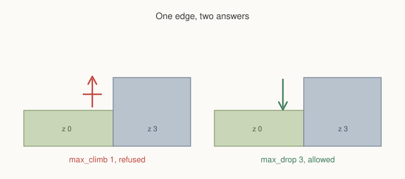
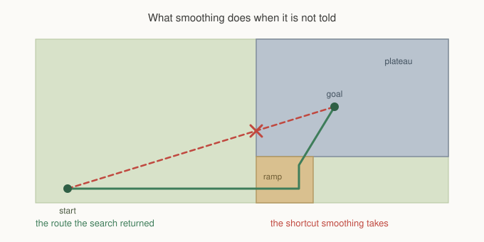

# Chapter 11: Ground That Isn't Flat

Welcome to the advanced section.

The first ten chapters built up a navigation system and then proved each piece
of it, because you had no reason yet to believe a framework you had just met.
That work is done. From here on the chapters assume you trust the results and
want to know how to get them, so we spend less time demonstrating and more time
on the parts that are easy to get subtly wrong.

We start with height, because it is the first thing that breaks the mental model
you have been using since Chapter 1. Every map so far has been a flat plane.
A cell was walkable or it was not, and if two cells were neighbours you could
step between them. Give cells a height and that second half stops being true.

## A number per cell, again

Chapter 6 introduced the idea of writing one number into every cell and letting
the arithmetic produce behaviour. Elevation is the same shape of idea, applied
to geometry instead of preference.

```gml
gmnav_grid_set_height(grid, 12, 8, 3);
gmnav_grid_fill_height(grid, 10, 4, 20, 12, 3);
```

The value is in whatever unit suits you. It is never converted to pixels, never
compared against your tile size, and never drawn. It exists so that two cells
can be compared, and that is all it does.

A grid with no heights set behaves exactly as it did in the first ten chapters.
The array is not even allocated until the first call, so nothing you already
have changes.

## Two limits, one edge

Height on its own changes nothing either. What changes behaviour is telling a
request how much of a difference the thing walking can handle.

```gml
gmnav_scheduler_request(sched, from, to, gmnav_priority.NORMAL,
                        false, profile, need_clear,
                        1,      // max_climb
                        3);     // max_drop
```

A step is refused when the rise exceeds `max_climb`, or when the fall exceeds
`max_drop`. Leave them undefined and heights are ignored entirely, which is
worth knowing: a grid can carry elevation that only some units care about.

Read those two numbers together and something falls out that you did not have
to write.



The same edge between the same two cells is refused in one direction and
allowed in the other. There is no one way flag anywhere in the framework. A
cliff you can jump down but not climb up is what you get when a unit's climb
limit is smaller than its drop limit, which is true of almost everything that
walks.

That is worth sitting with for a moment, because it is the whole design in
miniature. You are not describing what the map permits. You are describing what
the unit can do, and the map answers accordingly. Two units with different
limits read the same cliff differently, from one grid, with no duplicated data.

## Ramps are not a feature

There is no ramp type, no slope flag, no incline object. A ramp is a run of
cells whose heights step up by an amount the unit's climb limit allows.

If your plateau sits three units above the ground and your unit climbs one,
then three cells at heights 1, 2 and 3 form a ramp, and the search will find
it. If you would rather the ramp were gentler, use more cells and smaller
steps. If you want a ledge only a mountaineer can take, give it a single step
of 3 and let the ordinary units walk around.

This is the same reason Chapter 2 had no bridge logic. You price the world
honestly and the routes come out of the arithmetic.

## What the limits reach

Elevation is not a property of one subsystem. Once a request carries climb and
drop, every part of the framework that could route around them honours them.

**A\* refuses the step** while expanding, so an illegal edge is never in the
path to begin with.

**Flow fields honour the same limits**, and this one has a wrinkle worth
knowing. A field is built outward from the goal, but agents walk inward toward
it, so the height test is applied in reverse while building. A field built to a
goal on top of a cliff is not the same field as one built to a goal at its
foot, even on identical terrain. Build the field for the journey you mean.

**Corner cutting checks height too.** Chapter 2 established that a diagonal is
only offered when both flanking cells are open. On a grid with elevation, both
flanking cells must also be within the unit's limits, or a unit would squeeze
diagonally past a cliff corner that neither straight step would have allowed.

## The one that catches people

Here is where elevation goes wrong, and it is not in the search.



`gmnav_path_smooth` shortens a path by replacing a run of waypoints with a
straight line, and its test for whether that line is walkable is a test for
whether the cells are blocked. A cliff is not blocked. The cells at the top and
the cells at the bottom are both perfectly open, and the line between them is
clear in exactly the sense that test means.

So the search walks all the way round to the ramp, climbs it properly, and
smoothing then throws that away and cuts straight up the cliff face.

The fix is to tell it:

```gml
gmnav_path_smooth(path, agent.max_climb, agent.max_drop, agent.radius);
gmnav_path_simplify(path, 0.01, agent.max_climb, agent.max_drop);
```

Both take the limits, and both need them. `simplify` looks safer than `smooth`
because it only removes waypoints that lie on a straight line between their
neighbours, but a ramp seen from above is a straight line. Its waypoints are
collinear in every direction except the one that matters.

If you are using `gmnav_agent`, this is already done. The agent holds the
limits it requested with and passes them on. If you have written your own agent
class, and most projects eventually do, this is the line to check.

## Bodies on slopes

One more thing smoothing needs, and it applies whether or not your map has
height.

```gml
gmnav_path_smooth(path, climb, drop, agent.radius);
```

The fourth argument is the body radius, and with it the corridor test asks
whether the whole body fits along the line rather than whether the centre does.
Without it, a smoothed path will graze a cliff corner that the agent's shoulders
cannot clear, which looks like the agent clipping terrain and gets diagnosed as
a collision problem.

The cost is that a wide body refuses more shortcuts, so a large unit's path
keeps more waypoints than a small one's over identical terrain. That is correct
rather than wasteful. It is describing a body that genuinely has less room.

## When height is not enough

Elevation gives every cell one height, and that is its limit as much as its
shape.

A bridge over a road needs two heights in the same cell, one for the deck and
one for the road beneath it. A cliff you can walk both along the top of and
behind needs the same. A tower with a walkway around it needs three or four.
None of that is expressible as a number per cell, no matter how the numbers are
chosen, because the cell has more than one answer.

That is a different mechanism, and it is the next chapter.

## What you've learned

- **Height is one number per cell**, in your own units, never converted and
  never drawn. A grid with no heights behaves exactly as before.
- **`max_climb` and `max_drop` belong to the request**, not the map, so two
  units read the same terrain differently from one grid.
- **One way cliffs are arithmetic**, not a flag. A climb limit below a drop
  limit is what almost everything that walks looks like.
- **A ramp is a run of cells with steps the unit can take.** There is no ramp
  type, and there does not need to be one.
- **Flow fields test height in reverse**, because they build outward and are
  walked inward. Build the field for the journey you mean.
- **Smoothing and simplify both need the limits passing in**, or they undo the
  climb. A cliff is not blocked, and a ramp from above is a straight line.
- **Pass the body radius too**, or a smoothed line will graze a corner the
  agent's width cannot clear.

## What's next

Height per cell handles terrain that goes up and down. It cannot handle terrain
that is in two places at once.

In **Chapter 12** we add layers: a sparse set of extra walkable cells stacked
over the grid, joined to it wherever you say they join. Bridges, flyovers,
walkways behind cliffs, and the two rules that keep the whole thing from
becoming a second grid you have to maintain by hand.

See you there.
