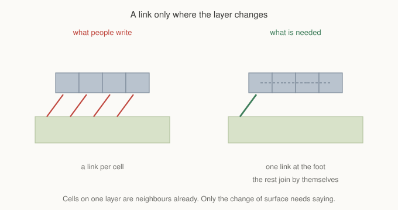
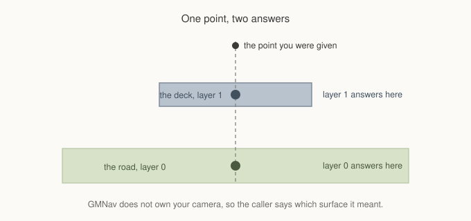

# Chapter 12: Two Things In One Place

Chapter 11 ended on a limit rather than a feature. Height per cell describes
ground that rises and falls, and it cannot describe ground that is in two
places at once.

A bridge over a road is the plain example. The cell under the bridge has two
answers: there is a road at ground level and a deck above it, and both are
walkable, and a unit on one of them is not on the other. No single height
satisfies that. Neither does a finer grid, because the problem is not
resolution. The cell genuinely holds two surfaces.

This chapter is about the mechanism for that, and about two rules that keep it
from turning into a second map you have to maintain by hand.

## An overlay sits beside the grid

An overlay is a sparse set of extra walkable cells stacked over a grid. Sparse
matters: you are not allocating a second grid, you are listing the handful of
cells that exist above the first one.

```gml
var _ov = gmnav_overlay_create(grid);

var _a = gmnav_overlay_add(_ov, 5, 4, 1);
var _b = gmnav_overlay_add(_ov, 5, 5, 1);
var _c = gmnav_overlay_add(_ov, 5, 6, 1);

gmnav_overlay_link(_ov, gmnav_grid_node(grid, 5, 3), _a, gmnav_link.STAIR, true);
gmnav_overlay_link(_ov, _c, gmnav_grid_node(grid, 5, 7), gmnav_link.STAIR, true);

gmnav_overlay_finish(_ov);
```

Three cells at column 5, on layer 1, joined to the ground at each end. That is
a bridge.

The nodes those calls return are ordinary node ids. They are larger than
`grid.count`, which is how the framework tells them apart, but everywhere you
would pass a node you can pass one of these. The search takes them, paths
contain them, agents walk to them, clearance measures them, cost profiles price
them, and every debug view draws them.

`gmnav_overlay_finish` bakes the edges. Until you call it the overlay has
cells but no connectivity, so call it once when you have finished authoring.

## The first rule

Look at what the example did **not** do: it did not link each deck cell to the
next one.



Cells on the same layer are neighbours by the ordinary neighbour table, exactly
as base cells are. A six cell walkway on one layer needs no links between its
own cells, because they already touch. What needs saying is the change of
surface, and that happens twice: getting on, and getting off.

**A link is only needed where the layer actually changes.**

This is the rule people break first, usually by writing a loop that links every
deck cell to its neighbour. It works, in the sense that the paths come out
right, and it produces an overlay with dozens of redundant edges that all have
to be walked at every expansion. The framework does not stop you. It just costs
you for nothing.

## The second rule

The other habit worth forming concerns what a layer means.

**One layer per standable surface, not per unit of height.**

A cliff three lifts tall is one layer, drawn tall. It is not three layers
stacked, because you cannot stand on the middle of a cliff face. The number in
`gmnav_overlay_add` is answering "which surface is this", not "how high is
this".

Height within a layer is a separate control. The layer lift sets how far apart
layers are drawn, and per-cell offsets shift individual cells between them,
which is how ramps work and is the next chapter.

Get this backwards and you end up with a layer per tile of elevation, hundreds
of them, most holding nothing, and links everywhere trying to reconnect a
surface that should have been one layer all along.

## Picking

Here is the part that has no tidy answer, and the framework is honest about it
rather than guessing.



When the player clicks, or an enemy asks what is at a position, a point over a
bridge genuinely has more than one answer. Which one is correct depends on the
camera, the game's rules, and what the player was looking at, and GMNav owns
none of those.

So it asks you:

```gml
var _road = gmnav_grid_world_to_node(grid, mouse_x, mouse_y, 0);
var _deck = gmnav_grid_world_to_node(grid, mouse_x, mouse_y, 1);
var _top  = gmnav_grid_world_to_node_top(grid, mouse_x, mouse_y);
```

The first two name a layer and return a node on it, or nothing if that layer
has no cell there. The third walks down from the highest layer and returns the
first surface it finds, which is what most games want most of the time and is
what "click on the thing you can see" usually means.

Agents carry a layer too, and `gmnav_agent_goto` takes one, so sending a unit
to the deck and sending it to the road below are different instructions with
the same coordinates.

## What the overlay inherits

An overlay cell is a real cell, not a marker. That is worth stating plainly
because it saves asking about each subsystem in turn.

Deck cells can be blocked and unblocked, which is how a collapsing span works.
They carry their own base cost, so a rickety walkway can be expensive without
touching the ground beneath it. Clearance measures them, and a deck narrower
than a unit's body reports exactly that. Cost layers and profiles reach them.
Flow fields cover them. Every debug view draws them at the height they sit at.

The one thing to hold in mind is that a deck's properties are its own. Dear
ground beneath a bridge does not make the bridge dear, and a blocked road does
not block the deck above it. That is the entire point of the mechanism, and it
is also the thing that surprises people the first time they stamp a radial cost
near a bridge and find the deck unaffected.

## Editing after the fact

Overlays are not frozen once built.

```gml
gmnav_overlay_set_blocked(_ov, _span, true);   // the bridge collapses
gmnav_overlay_set_cost(_ov, _span, 8);         // or merely becomes unpleasant
```

Blocking a span refuses that cell and leaves every other crossing on the map
working. You do not need to rebuild the overlay for a change of state, only for
a change of shape: adding or removing cells, or adding links.

Chapter 9's advice applies here unchanged, and is worth repeating in this
context. A span that is usually passable is better modelled as expensive than
as blocked, because an expensive deck can never strand anybody while a blocked
one can.

## What you've learned

- **An overlay is a sparse set of cells above the grid**, and its nodes are
  ordinary node ids that every subsystem already understands.
- **A link is only needed where the layer changes.** Cells on one layer are
  already neighbours, so a walkway needs a link at each end and nothing in
  between.
- **One layer per standable surface**, not per unit of height. A tall cliff is
  one layer drawn tall.
- **Picking has no single answer**, so the caller names a layer.
  `gmnav_grid_world_to_node_top` is the usual convenience.
- **A deck cell is a real cell**: blockable, priceable, measurable, and
  independent of the ground beneath it.
- **State changes need no rebuild**, only shape changes do.

## What's next

A bridge is flat. Terrain rarely is, and a deck that jumps from ground level to
its full height in one step reads as a wall with a door in it rather than
something you walk up.

In **Chapter 13** we cover ramps: per-cell offsets that let a surface climb in
even fractions of a layer, how to author them without computing the fractions
yourself, and the rendering problem they create, which is that a ramp drawn as
flat cells looks like a staircase no matter how smoothly the navigation treats
it.

See you there.
