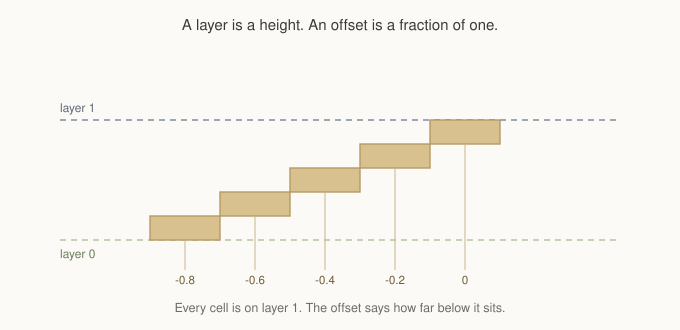
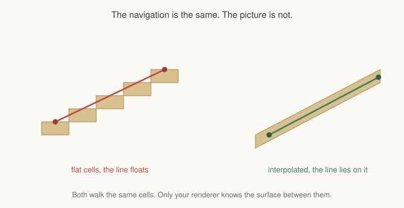

# Chapter 13: Ramps

Chapter 12 left you with a bridge that jumps from the ground to its full height
in a single step. Navigationally that is fine, and a stair is a perfectly
reasonable thing for a bridge to have. But most raised ground in most games is
not reached by a stair. It is reached by a slope, and a slope needs the surface
to exist at every height between the two ends.

Layers cannot express that on their own. A layer is one height, and Chapter 12
was firm that you should not stack layers to fake intermediate ones. So there
is a second control, and this chapter is about it.

## An offset is a fraction of a layer

Every overlay cell carries an offset, defaulting to zero, that shifts it away
from its layer's nominal height.



All five cells in that picture are on layer 1. None of them is on layer 0, none
of them is on some intermediate layer that does not exist, and the search
treats them as one connected surface because they are one connected surface.
The offset only says how far below their layer each one sits.

Offsets are negative by convention, measuring downward from the layer. Zero
means the cell sits exactly at its layer's height, which is where a flat deck
lives. Positive values are legal and shift a cell above its layer, which is
occasionally useful for a lip or a raised edge, but a ramp descends into the
gap below.

```gml
gmnav_overlay_set_offset(_ov, _node, -0.5);
```

## Authoring one

You will almost never write those fractions yourself.

```gml
var _cells = [];
for (var _c = 4; _c <= 9; _c++) {
    array_push(_cells, gmnav_overlay_add(_ov, _c, 10, 1));
}

gmnav_overlay_ramp(_ov, _cells);
```

Hand it the cells in order from the foot to the top and it spaces the offsets
evenly. Six cells give you six equal steps of a sixth of a layer each. Four
cells give you four steps of a quarter.

That is the whole control you need over steepness. A longer ramp is gentler,
because the same height is divided among more cells. If a unit's climb limit
refuses your ramp, the answer is more cells, not a different function.

The order matters and nothing checks it for you. A ramp handed its cells
backwards climbs the wrong way, which produces a surface that descends from a
deck into the ground and connects to nothing at the far end. If a ramp you have
just authored refuses to route, that is the first thing to check.

For a ramp descending in the other direction, hand the array in from its low
end rather than reversing the offsets by hand.

## What the foot looks like

There is a detail here that surprises people, and it is arithmetic rather than
a limitation.

An evenly spaced ramp's first cell is not at ground level. Six cells divide the
layer into sixths, so the lowest sits one sixth of a layer above the ground it
meets. There is a small step at the foot, always, and its size is one over the
number of cells.

For most tile sizes and most ramp lengths this is a pixel or two and nobody
notices. On a short ramp with a tall lift it is visible, and the fix is a
longer ramp rather than a special case.

## Ramps and the climb limit

Chapter 11 said a ramp is a run of cells whose heights step up by an amount the
unit's climb limit allows. That was about `height_z` on the base grid, and it
is worth being clear that overlay offsets are a different thing entirely.

Offsets are **not** consulted by `max_climb` and `max_drop`. They describe where
a cell is drawn, not what it costs to get onto. A ramp on an overlay is walkable
because its cells are neighbours on one layer, and that is true regardless of
how steeply they are offset.

If you want a slope that only some units can climb, use `height_z` on the base
grid, which Chapter 11 covered. If you want a slope that everything can walk and
that looks like a slope, use offsets. Both are legitimate, and a map can use
each in different places.

## The part your renderer owes

Now the thing that catches everyone, and it is not a navigation problem at all.



The framework gives you a route through cells and a position for each one. It
has no notion of the surface between two cells, because that is geometry it does
not own and does not draw.

So when a path crosses a ramp, the waypoints sit at each cell's own height and
the line between them is a straight interpolation. If your renderer draws the
ramp as flat cells at stepped heights, the path visibly floats above the steps
in the middle of each span. If your renderer interpolates the surface, the same
path lies on it exactly.

The navigation is identical in both cases. Only the picture differs.

The practical consequence for an agent is the same shape: applying the framework's
velocity moves a unit along the straight line between waypoints, so it rises
linearly across a ramp rather than following the stepped profile. On a ramp
drawn as a smooth slope, that is exactly right. On one drawn as steps, your
movement code should sample the surface height itself, which it can do because
it is your surface.

The debug renderer draws ramp cells flat, at each cell's own height, because
that is what the data says. It is not trying to be pretty. When you are looking
at a ramp in the debug view and it looks like a staircase, the data is a
staircase, and your game's smooth-looking slope is your renderer's contribution.

## Smoothing across a ramp

One more interaction, and it follows from Chapter 11.

Smoothing shortens a path by replacing runs of waypoints with straight lines,
and a ramp is a straight run of cells on one layer. So a smoothed path across a
ramp collapses to a single segment from foot to top, which is correct and is
usually what you want.

Two things stop it, and both are legitimate:

**A narrow ramp and a wide body.** If you pass an agent radius, the corridor
test asks whether the whole body fits along the line. A ramp one cell wide
cannot contain a body wider than one cell, so every shortcut is refused and
every ramp cell survives as a waypoint. That is not a bug, and the fix is a
wider ramp rather than a smaller test.

**Cost.** If you pass a profile, a shortcut is only taken when it is no dearer
than the run it replaces. A ramp with expensive cells behaves accordingly.

If you find a ramp keeping every waypoint and you did not expect it, those two
are the first things to check, in that order.

## What you've learned

- **An offset is a fraction of a layer**, not a layer of its own. A ramp is one
  surface whose cells sit at different fractions below it.
- **`gmnav_overlay_ramp` spaces them evenly.** Hand it the cells from foot to
  top, and steepness is a function of length.
- **Order matters and is not checked.** A backwards ramp connects to nothing.
- **The foot sits one step above the ground**, by arithmetic. A longer ramp
  makes that step smaller.
- **Offsets are drawn height, not climb cost.** For a slope only some units can
  take, use `height_z` on the base grid instead.
- **The surface between two cells is your renderer's**, so a path across a ramp
  is a straight interpolation and looks right only if your ramp is drawn
  interpolated too.
- **A ramp narrower than a body will not smooth**, and neither will an
  expensive one under a profile.

## What's next

Everything so far has assumed a unit may move in whatever direction the grid
allows and the path may bend at any angle. Plenty of games are not like that. A
character with four directional sprites cannot walk a diagonal, and one with
eight cannot walk a shallow slope, however clear the line between two points
happens to be.

In **Chapter 14** we cover movement constraints: how to tell the framework which
headings a unit may take, why the search and the path shaping are two separate
answers to that question, and the rewrite that turns a legal staircase into legal
straight legs.

See you there.
