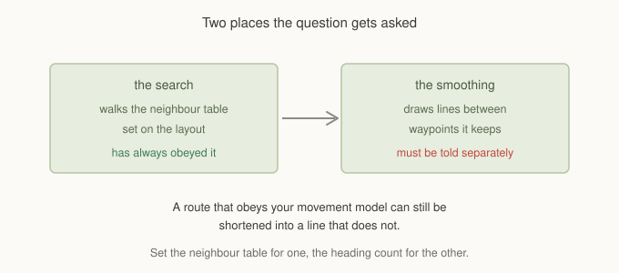
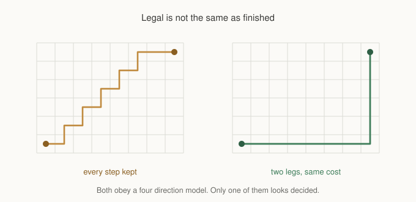

# Chapter 14: What A Unit Is Allowed To Walk

Every chapter so far has let a path bend at whatever angle the geometry allowed.
For a lot of games that is right. A ball rolls at any angle, a bird flies at any
angle, a top down shooter's marine strafes at any angle.

Plenty of games are not like that. A character with four directional sprites
cannot walk a diagonal, however clear the line happens to be. One with eight
cannot walk a shallow slope. A tactics game moves piece by piece on cardinal
steps because that is its rule, not because of anything geometric.

This chapter is about telling the framework which headings a unit may take, and
about the fact that the question gets asked in two different places.

## The search has always known

Set the neighbour count on the layout and the search obeys it.

```gml
layout = gmnav_layout_create(gmnav_layout.ORTHO, 32, 32, gmnav_neighbours.FOUR);
```

Chapter 2 covered this. `FOUR` gives cardinal steps only, `EIGHT` adds
diagonals, `SIX` is for hex, and the heuristic changes to match so it stays
admissible. A search on a four direction grid returns a route made entirely of
cardinal steps, every time, and always has.

That part needs nothing from you beyond choosing the right value.

## The shaping did not



Path smoothing is a separate pass with a separate job. It takes the route the
search produced and replaces runs of waypoints with straight lines wherever the
line is clear. Its test for "clear" is about walls, bodies, layers and cost. It
was never about headings.

So on a four direction grid the search would hand over a perfectly cardinal
route and smoothing would collapse it into one long diagonal, because the
diagonal was unobstructed and shorter. Every constraint you set was honoured
right up until the last step, where it was quietly discarded.

Two things follow from that, and both matter.

The first is that this needs telling separately:

```gml
gmnav_path_smooth(path, climb, drop, radius, 4);
```

The fifth argument is the number of headings the result may use. Zero, the
default, means unconstrained, so nothing you already have changes shape. Four
means cardinals. Eight means cardinals and true diagonals.

The second is subtler and catches people who only fix the first.

## The constraint shapes, it does not impose

Setting eight headings on a four direction grid does nothing useful, and
setting four headings on an eight direction grid does not give you cardinal
movement.

Smoothing can only remove waypoints. It cannot rewrite the steps the search
took. If the search produced diagonal steps because the grid allows diagonals,
those diagonals are in the path already, and a heading constraint applied
afterwards cannot undo them.

**The neighbour table and the heading count have to agree.** The first decides
what steps exist, the second decides which lines may replace them. A unit
restricted to cardinals needs a grid searched with `FOUR` and smoothing told
`4`. One of the two on its own gives you half the answer.

This is also why the setting lives on the path rather than the grid. One map
serves a rolling ball and a four directional character, and they need different
answers from the same cells. Same argument Chapter 6 made about weights
belonging to the profile rather than the layer.

If you are using `gmnav_agent`, it carries a `headings` field and forwards it,
so the agent side is one assignment.

## Legal is not the same as finished

Constrained smoothing on its own produces something correct and unsatisfying.



The left path is what you get from refusing illegal shortcuts and nothing else.
Every segment is cardinal, so it obeys the model, and every single waypoint the
search produced is still there. Nothing collapsed, because on a staircase no run
of cells is longer than one cell before the direction changes. There is nothing
for a straight line to replace.

The right path is the same journey as two straight legs.

Both are legal. Both cost exactly the same to walk, because on a uniform grid
any monotone staircase between two points costs the same as the L between them.
Only one of them looks like a decision.

So constrained smoothing does more than refuse. When it cannot find a single
legal straight line between two waypoints, it looks for a pair of legal legs
joined by a corner, and takes the furthest one that works.

That corner is a cell the search never visited, which is worth noticing. Every
other waypoint in a path came from A\*. This one is proposed by the shaping pass
and then checked, with the same corridor test a single leg gets, body radius
and all. Both corner orders are tried, since a wall may leave only one of them
viable, and if neither passes the staircase stands.

A single leg is always preferred over two. A pair that reaches further than a
single line is still a pair, and the straight line is never the longer answer.

## On eight directions

The same machinery handles diagonals, and it earns more there than you might
expect.

On an eight direction grid the legal headings include the four diagonals, so a
shallow slope that is neither cardinal nor forty five degrees becomes a diagonal
leg plus a cardinal one. The corner candidates are ordered so the diagonal part
is tried first, which matters: a square L and a diagonal-then-straight pair both
join the same two points, and the diagonal version is shorter.

The practical effect is that an eight direction path constrained this way sits
close to an unconstrained one in length while using only headings the unit can
actually face.

## What it costs

Two things to be honest about.

**The corner is chosen for clearance, not cost.** The legs are checked for
walls and bodies, and on uniform ground the L costs exactly what the staircase
cost, so nothing is lost. On terrain with varied cost that equality does not
hold, and a staircase that happened to thread cheap cells may be replaced by
legs that cross dearer ones. If your map leans heavily on cost fields, be aware
that the rewrite optimises shape rather than price.

**Constrained smoothing is cheaper than unconstrained**, which is not obvious.
The heading test is arithmetic on two cell coordinates and runs before the
corridor walk, so most candidate shortcuts are rejected without ever touching
the grid. You are not paying for the constraint.

## What you've learned

- **The neighbour table constrains the search**, and always has. That part is
  Chapter 2 and needs nothing new.
- **Smoothing is a separate pass** that was never told about headings, so a
  cardinal route could be collapsed into a diagonal.
- **The heading count is the fifth argument to `gmnav_path_smooth`**, off by
  default so nothing existing changes.
- **The two must agree.** A heading constraint cannot undo steps the search
  already took, so the grid's neighbour set has to match.
- **It lives on the path, not the grid**, because one map serves units with
  different movement models.
- **Refusing illegal shortcuts leaves a staircase**, so the pass also rewrites
  a run into the fewest legal legs, inventing a corner and checking it properly.
- **A single leg always beats a pair**, and on eight directions the diagonal
  decomposition is tried before the square one.

## What's next

A path made of straight legs meeting at hard corners is honest about where it
turns, and it is not how anything with momentum moves. A vehicle has a turning
radius, a boat has inertia, a character with a turn animation needs time to face
a new direction.

In **Chapter 15** we round those corners. Two modes, why every generated segment
has to be checked against the same geometry the search used, and when a smooth
curve is exactly the wrong thing to ask for.

See you there.
