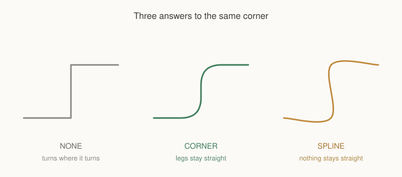
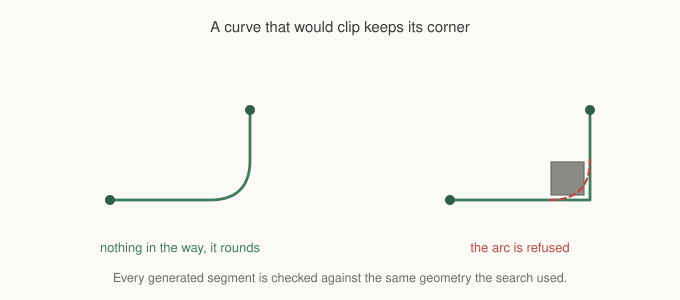

# Chapter 15: Turning Corners

A path is a sequence of straight legs meeting at corners. That is an honest
description of a route and a poor description of movement.

Nothing with momentum turns instantly. A vehicle has a turning radius. A boat
carries its heading for a while after the rudder moves. A character with a turn
animation needs frames to face a new direction, and if the path insists on a
right angle the animation either gets skipped or the character slides through it.

Chapter 4's arrival easing softened the ends of a journey. This chapter softens
the middle.

## Two modes, and a default that does nothing

```gml
gmnav_path_curve(path, gmnav_curve.CORNER, 40, 5, agent.radius);
```



`NONE` is the default and leaves the path exactly as it was, so adding the call
to existing code changes nothing until you ask for something.

`CORNER` rounds each turn to a radius and leaves the straight legs alone. A
corridor still reads as a corridor, and only the joints change. This is what
most games want, and if you only ever use one mode it should be this one.

`SPLINE` runs a curve through every waypoint, so nothing stays straight. It
suits things that never travel in straight lines anyway: flying units, boats,
camera paths, anything where the route is a suggestion rather than a track.

Notice the third panel above. The spline bulges past its own endpoints at both
ends, because a curve through a set of points is not bounded by them. That is
inherent to the technique rather than a flaw, and it is the main reason `CORNER`
is the safer default.

## What the numbers mean

```gml
gmnav_path_curve(path, mode, radius, samples, body, min_turn);
```

**Radius** is how far back from each corner the rounding begins, in pixels. It
is clamped to half of each adjacent leg, so two corners close together never
consume the same segment and a short leg simply gets a tighter curve. You can
set it larger than your corridors and nothing breaks, you just get less rounding
than you asked for.

**Samples** is how many points each arc is built from. Four or five is plenty
for movement. More is only worth it if you are drawing the curve at high zoom,
and every sample is a point your agent will steer at.

**Body** is the agent radius, and it does the same job it does in smoothing. A
curve that fits the centre line may not fit the shoulders.

**Min turn** is the angle below which a joint is left alone. A path often has
waypoints where the direction barely changes, and rounding those adds points
for no visible benefit.

## Everything generated is checked

Here is the part that matters more than the modes.



A rounded corner cuts across the inside of a turn. That is the whole point of
rounding, and it means the curve occupies ground the original path did not.
Sometimes that ground has a wall in it.

So every segment the curve generates is tested against the same geometry the
search used, body radius included. If any part of an arc would clip, the arc is
discarded and that corner stays sharp. Under `SPLINE`, a segment that would clip
reverts to the straight line between its endpoints.

A curve that cuts a wall is worse than a corner, so the corner wins.

The consequence worth expecting: in tight terrain, a curved path is partly
curved. Corners in the open round nicely, corners in doorways stay sharp, and
the same call produces different amounts of smoothing in different parts of one
map. That is the check doing its job rather than the mode failing.

## Where curving sits

Order matters, and it is the same order the agent uses internally:

```gml
gmnav_path_smooth(path, climb, drop, radius, headings, profile);
gmnav_path_anchor_start(path, x, y);
gmnav_path_anchor_end(path, goal_x, goal_y);
gmnav_path_curve(path, gmnav_curve.CORNER, 40, 5, radius);
```

Smooth first, because rounding a staircase corner by corner produces a wobbly
line rather than a curve, and there is no point curving waypoints that are about
to be deleted.

Anchor next, so the curve accounts for where the unit really is rather than the
centre of the cell it happens to occupy.

Curve last.

If you are using `gmnav_agent`, set `curve_mode`, `curve_radius` and
`curve_steps` on it and this is all done for you in that order.

## When not to

Three cases where curving is the wrong answer.

**Grid locked movement.** If you spent Chapter 14 constraining a unit to four
headings, do not then curve its path. A curve has every heading in it. The two
features are answers to opposite questions and using both leaves you with
neither.

**Tight terrain.** In a map that is mostly corridors, most corners will refuse
the arc anyway, so you are paying for a pass that produces almost nothing.
Check whether it visibly helps before leaving it on.

**When your movement code already handles it.** Steering behaviours, a turning
radius model, or anything that eases toward its target is already producing a
curved trajectory from a cornered path. Curving the path as well gives you two
smoothing systems in series, and the result is usually mushier than either
alone.

That last one is worth taking seriously. Chapter 4's agent eases toward each
waypoint by design, so a path that is already smoothed will look reasonably
smooth in motion without any curving at all. Reach for this chapter when that
is not enough, not by default.

## What you've learned

- **`CORNER` rounds joints and leaves legs straight.** `SPLINE` curves
  everything. `NONE` is the default and changes nothing.
- **A spline overshoots its own waypoints**, which is inherent, and the reason
  `CORNER` is the safer choice.
- **Radius is clamped to half of each leg**, so short segments get tighter
  curves rather than broken ones.
- **Every generated segment is validated** against walls and body radius, so a
  corner that would clip stays sharp and a curved path in tight terrain is only
  partly curved.
- **Smooth, anchor, then curve**, in that order.
- **Do not curve a heading constrained path**, and consider whether your
  steering already does this job.

## What's next

Chapter 6 priced the ground so units would avoid it. That covered hazards that
sit still. Real hazards move: a fire spreads, a patrol walks its route, a
turret's field of fire sweeps as it turns.

In **Chapter 16** we cover painting cost along a route rather than around a
point, keeping it affordable when the thing being painted moves every frame, and
the honest answer to the question everyone asks eventually, which is whether
cost can pull as well as push.

See you there.
