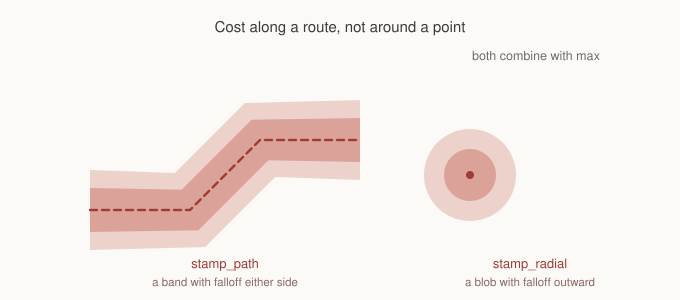
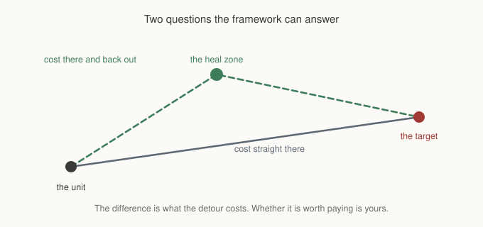

# Chapter 16: Danger Along A Route

Chapter 6 gave you influence maps and a turret. The turret sat still, and a
radial stamp was the right shape for it.

Most of what makes a map dangerous does not sit still. A patrol walks a route. A
fire spreads down a corridor. A road is dangerous along its whole length rather
than at one point on it. A player leaves a trail that pursuers should spread out
around rather than follow single file.

None of those is a circle, and this chapter is about the two things that
follow: painting cost along a line, and keeping it affordable when the line
moves.

## A band instead of a blob



```gml
var _rect = gmnav_costlayer_stamp_path(layer, points, width, peak, falloff);
```

`points` is an array of world space pairs, in order. The stamp paints a band
along that polyline, with the peak on the centreline and falloff outward to
`width`, exactly as `stamp_radial` falls off from its centre.

Everything you know from Chapter 6 carries over. Stamps combine with **max**
rather than adding, so two segments overlapping at a corner produce a corner
that is dangerous rather than twice as dangerous, and restamping the same route
changes nothing. Layers still add to each other; only stamps within a layer
take the higher value.

The returned rectangle is the cells actually written, not the area scanned. That
distinction matters for the next section.

You could approximate this with a chain of radial stamps, and people do. It
produces a lumpy field with bulges at every sample point, and a bounding
rectangle far larger than the band itself, which makes the rebaking below far
more expensive than it needs to be.

## Peaks want to be modest

A practical point that is easy to get wrong and hard to diagnose.

Base cost is 1. If your stamp peaks at 40, a cell in the middle of the band
costs forty times an ordinary cell, and any profile weight above roughly a tenth
puts the detour ahead of the crossing by a wide margin. Turn the weight up and
down and nothing appears to change, because every value you try is far past the
point where the decision flips.

Keep peaks within about an order of magnitude of the base cost. Chapter 2 used 8
for swamp and Chapter 6 used 20 for a turret, which is the right sort of range.
At peak 8, weights between zero and one give you a visible spectrum: straight
through, clipping the edge, and going properly around.

This is worth internalising as a general property rather than a tuning tip. A
search picks the cheaper of two routes, so a unit never partially avoids a
hazard. It flips. What a designer tunes is where that flip happens, and a peak
that swamps everything leaves nothing to tune.

## Moving it

A full rebake walks every cell in the map, which is not a per frame operation.
A patrol that moves every frame needs its cost updated every frame.

The answer is to rebake only the rectangles involved:

```gml
gmnav_costlayer_clear_region(danger, old[0], old[1], old[2], old[3]);

var _new = gmnav_costlayer_stamp_path(danger, ahead_of_the_guard(), 56, 8, 1);

gmnav_costprofile_bake_region(profile, old[0], old[1], old[2], old[3]);
gmnav_costprofile_bake_region(profile, _new[0], _new[1], _new[2], _new[3]);

old = _new;
```

**Both rectangles, always.** Clear and rebake the area being vacated as well as
the area newly covered. Skip the old one and the danger stays burned into the
resolved array forever, so your patrol leaves a permanent trail behind it that
nothing ever removes.

Two additions to what Chapter 6 said about this.

**Region baking is per profile.** If three unit types read the same danger
layer, all three profiles need both rectangles rebaking. A profile that misses
the update is not stale in any way the framework can tell you about; it simply
holds an older world and routes accordingly.

**`bake_region` does not clear the dirty flag**, deliberately, because it only
guarantees the rectangle you named. The rest of the map may still be out of
date and pretending otherwise would hide bugs.

## Stamping ahead rather than at

A patrol that stamps danger at its own position produces units that dodge where
the guard is standing. Stamping the stretch it is **about to walk** produces
units that get out of its way, which is what a person watching would call
anticipation.

The stamp takes a polyline, so this costs nothing extra: hand it the next few
cells of the route rather than the current one. How far ahead is a tuning value,
and it reads directly as how cautious the units seem.

## Can cost pull as well as push?

This question arrives sooner or later, usually phrased as a heal zone or a
pickup. If expensive ground repels, can cheap ground attract?

The short answer is no, and it is a hard no rather than a missing feature.

You can write a negative weight:

```gml
gmnav_costprofile_add(hunter, danger, -1);
```

and resolved cost still clamps at 1. That clamp is the same guarantee as
Chapter 2's cost floor. The heuristic assumes every step costs at least 1, and a
cell cheaper than that makes the heuristic an overestimate, which breaks A\*'s
optimality quietly and gives you worse paths with no error anywhere. So a
negative weight makes dangerous ground **ordinary**, never attractive.

The pairing worth remembering: **cost fields push, flow fields pull.** To draw
units toward something, seed it as a goal in a field. Chapter 8 showed that
several goals in one field cost almost nothing over one, so a set of heal zones
or pickups is a single build and every unit reads its nearest.

## Is the detour worth it?

That still leaves the interesting question, and it is the one your AI actually
wants to ask. Not "where is the heal zone" but "should I go via it on my way to
the fight".



The framework can price both halves:

```gml
var _direct = cost_of(from, target);
var _via    = cost_of(from, heal) + cost_of(heal, target);

var _detour = _via - _direct;
```

`_detour` is what the diversion costs in real navigation terms, with walls,
terrain and danger all accounted for, which is a far better input than
straight line distance. Whether that number is worth paying depends on the
unit's health, its aggression, and what the designer wants, and none of that is
navigation. GMNav tells you the price. Your game decides.

For a crowd, `gmnav_flowfield_cost_at` gives you the first half of that
comparison for every unit at once. Build one field seeded at every heal zone and
each unit can read its own true cost to the nearest one in a single lookup, no
searches at all.

This is the same boundary the framework draws everywhere. The agent proposes a
velocity and does not move anything. The platformer graph says a jump is needed
and does not press the button. The cost comparison says a detour costs forty and
does not decide whether forty is too much.

## What you've learned

- **`stamp_path` paints a band along a polyline**, with the same max combining
  and the same falloff as a radial stamp.
- **The returned rect is what was written**, so region rebaking stays tight.
- **Keep peaks within an order of magnitude of base cost**, or every weight sits
  past the flip and there is nothing left to tune.
- **A unit never partially avoids a hazard.** It flips at the crossover, and
  what you tune is where that sits.
- **Both rectangles, always**, and once per profile that reads the layer.
- **Stamp the route ahead rather than the position**, and units look like they
  anticipate.
- **Cost cannot attract.** Negative weights clamp at 1, because the cost floor
  is what keeps the heuristic honest. Cost pushes, fields pull.
- **The detour comparison is two costs and a subtraction**, and the decision
  that follows belongs to your game.

## What's next

Chapter 9 covered a world that changes: doors closing, walls breaking, and what
happens to a search that was already running. That chapter's advice still holds,
but the agent layer has changed underneath it, and the cost of reacting to
change turns out to matter as much as the correctness of it.

In **Chapter 17** we return to dynamic worlds with a harder question: not
whether an agent notices a change, but whether it should care. On a map that
changes every second, most changes are none of most units' business, and finding
that out cheaply is the difference between a game that runs and one that
crawls.

See you there.
