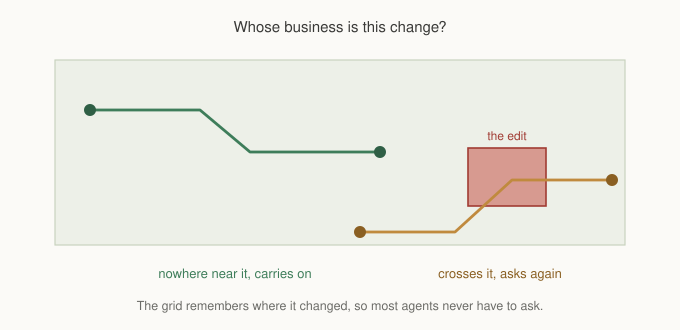

# Chapter 17: A World That Keeps Changing

Chapter 9 covered a world that changes. Doors close, walls break, a barricade
lands where the guards were heading. It explained the version counter, the
difference between a search that has finished and one that was suspended
mid-flight, and why restarting a search on every change would livelock in
exactly the games that need dynamic obstacles most.

All of that still holds. This chapter is about a question that chapter did not
ask, which turns out to matter as much as correctness: not whether an agent
notices a change, but whether it should care.

## Noticing is not free

Chapter 9 described an agent that notices its path went stale and requests a
replacement. Two things about how that works deserve more attention than they
got.

The first is what "stale" means to an agent. A path is built at a moment, and
the world moves on afterwards. Comparing the world's version against the version
the path was built at is what tells an agent that something happened since.

The second is the word *something*. The version counter is one integer for the
whole grid. It says a change occurred. It does not say where.

On a map where changes are rare, that is fine. A door opens occasionally, a
handful of agents re-request, the queue absorbs it. On a map where changes are
constant, it is not fine at all, and the way it fails is worth understanding
because it looks like a different problem.

## The failure that looks like something else

Picture a tower defense. Two hundred creeps walking a map, and a player placing
a wall every second or two.

Every wall placement bumps the version. Every agent compares its path's version
against the grid's, finds a difference, and asks for a new path. Two hundred
requests, for one wall, most of which is nowhere near most of them.

The scheduler does its job perfectly. The budget holds, the frame rate holds,
and the queue drains as fast as it can. What you see is that every agent's path
arrives late, permanently, because the queue never empties. The stats overlay
shows pending sitting high forever.

The natural conclusion is that the budget is too small, so you raise it. That
makes the symptom go away by doing all the unnecessary work faster, which costs
frame time to compute paths that were already correct.

The real problem is that most of those two hundred requests should never have
been made.

## Asking a better question



The grid knows exactly which cells changed at the moment they change. Every
edit function has that information in hand: a cell setter knows its cell, a fill
knows its rectangle. Keeping only a counter throws that away.

So the grid keeps a small ring of recent edit rectangles alongside the version.
An agent compares its remaining route against those rectangles, and only asks
for a new path if a change landed on ground it has still to walk.

```gml
gmnav_grid_changed_since(grid, my_version, c1, r1, c2, r2);
```

If you are using `gmnav_agent`, this is already how it decides. If you have
written your own agent class, this is the call, and the pattern is: remember the
version you last checked, test your remaining path against changes since then,
and move your stamp forward when nothing concerns you.

That last part is what makes it cheap in the common case. Once an agent has
looked and found nothing relevant, its stamp moves to the current version, and
the next frame's check is a single integer comparison until something else
changes.

## When the history runs out

A ring holds a fixed number of entries, so a long-lived agent that has not
looked in a while can have a stamp older than anything still recorded.

The framework's answer is to repath unconditionally in that case. The history
it needed has been overwritten, so the honest answer to "did anything relevant
change" is "I cannot tell you".

That degrades to the old behaviour rather than to silence, which is the correct
direction to fail. An agent doing unnecessary work is a performance problem. An
agent walking through a wall because nobody could remember whether the wall
appeared is a correctness problem, and those are not equally bad.

The ring size is a config value:

```gml
gmnav_init({ EDIT_RING : 64 });
```

Larger holds more history and costs a slightly longer scan. Smaller overflows
sooner and falls back to conservative repathing more often. The default is
reasonable for most games, and the case for raising it is a map with bursts of
many small edits between agent updates.

## What still belongs to Chapter 9

Everything that chapter said about the contract is unchanged, and it is worth
restating because the improvements above are about cost, not correctness.

A search that **completed** before an edit produced a real path. It may no
longer be a good one, but nothing is corrupted.

A search that was **suspended** mid-flight has already committed to the cells it
settled, and settled cells are never revisited. A wall landing on ground it has
already crossed off goes unnoticed. The promise is termination plus a stale
flag, not path validity.

**Clearance, cost profiles and flow fields all derive from the grid** and all go
out of date when it changes. The first two can rebuild themselves on demand.
Flow fields cannot, and a field built before an edit still describes the old
world, arrows and all.

And the advice about doors still stands, more strongly now that you know what
repathing costs. A door that is usually open is better modelled as expensive
than as blocked. An expensive door never strands anybody, and it does not force
a decision on anyone whose route merely passes nearby.

## Rate limiting is still yours

Scoping reduces how many agents ask. It does not change how often one asks.

```gml
agent.repath_gap = 20;
```

An agent standing next to something that keeps changing will still hit the
scoped test every time, find it relevant every time, and request. The gap is
what stops that becoming one request per frame. Both mechanisms are needed:
scoping keeps the uninterested out, the gap keeps the interested reasonable.

## What you've learned

- **Chapter 9's contract is unchanged.** Completed searches are safe, suspended
  ones are not, derived structures go out of date.
- **The version counter says something changed, not where**, and on a map with
  constant edits that means every agent reacts to every change.
- **The failure looks like an undersized budget**: permanently high pending, and
  raising the budget hides it by doing the unnecessary work faster.
- **The grid keeps recent edit rectangles**, so an agent only repaths when a
  change lands on the part of its route still to walk.
- **Once an agent has looked and found nothing, its check costs one comparison**
  until the next edit.
- **A lost history repaths unconditionally**, degrading to the old behaviour
  rather than to silence.
- **Scoping and rate limiting solve different halves**, and you want both.

## What's next

Every agent in this series so far has walked on ground. Chapter 10 built a
navigation graph for a side view game by simulating jump arcs, and then stopped
at the boundary: it told you a jump was needed and left the jumping to you.

In **Chapter 18** we cross that boundary. The platform agent follows a baked
jump graph by replaying the launch velocity each link was built from, which is
the one place in the framework where GMNav moves something itself, and the
reasons for that exception are worth understanding before you rely on it.

See you there.
