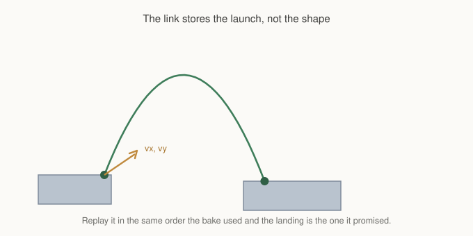

# Chapter 18: Following A Jump Graph

Chapter 10 ended at a boundary and was firm about it. GMNav works out which
ledges connect by simulating your character's jump arcs, tells you a jump is
needed and where it lands, and does not press the jump button. Variable jump
height, coyote time, input buffering and air control all differ per project, and
a library guessing at them would be wrong for everyone.

That boundary is still the right one for a character your player controls, or
one with an animation state machine you care about.

It is a lot of work for a bat.

Not every side view game needs its enemies to have a bespoke controller. A patrol
that walks a route and hops between two crates does not need coyote time. For
those, the framework will drive the character itself, and this chapter is about
that path and about what you give up by taking it.

## The one exception

`gmnav_platagent` is the only place in GMNav that moves something.

```gml
pa = gmnav_platagent_create(sched, graph, move, x, y);

gmnav_platagent_goto(pa, target_x, target_y);
gmnav_platagent_update(pa);

x = pa.x;
y = pa.y;
```

Everywhere else the framework proposes and your code disposes. Chapter 4 spent a
page explaining why: your game already has movement and collision, and a
navigation library that also moved instances would be a second movement system
racing the first.

That argument does not apply here, and the reason is worth being precise about.

## Why replay has to own the stepping



When the graph was baked, each jump link was produced by simulating an arc:
apply gravity, clamp to terminal velocity, move horizontally, test, move
vertically, test. The link that survived stores the launch velocity that
produced it, not the path it traced.

Replaying that link means running the same integration again. Same gravity, same
clamp, same order, same collision test. Do that and the character lands exactly
where the graph promised, because it is the same computation.

Change any part of it and the arc drifts. Apply gravity after the horizontal
move instead of before and each frame is off by a fraction of a pixel. Over a
short hop that is invisible. Over a long jump it lands somewhere the graph never
said it would, on a ledge that may not be there.

So the replay cannot hand you a velocity and hope. It has to own the stepping
order, because the stepping order is the promise.

## What it does for you

The agent walks `WALK` links along a ledge, runs off the edge for `FALL` links,
and launches with the stored velocity for `JUMP` links. It tracks which link it
is performing, integrates the arc, and picks up the next link on landing.

```gml
gmnav_platagent_arrived(pa);    // latched, like the grid agent
gmnav_platagent_airborne(pa);   // mid arc right now
gmnav_platagent_has_route(pa);
```

`airborne` is the useful one for presentation. It is how you pick a jump
animation without inspecting the link yourself, and it is true for exactly the
frames the character is off the ground.

Retargeting works mid-arc. Call `goto` while the character is in the air and it
finishes the arc it committed to, then routes from wherever it lands. That is
deliberate: interrupting a ballistic trajectory halfway is not something the
graph can price, and a character that changes direction in mid-air reads as
weightless.

## Desync

The agent counts the frames where its own position disagreed with what the
replay expected.

```gml
pa.desync
```

In normal operation it stays at zero. A non-zero value means the replay and the
world disagreed, and there are only a few ways that happens.

**The movement model does not match the level.** Chapter 10 warned that the
numbers in `gmnav_movement_create` must be your controller's real ones. If the
graph was baked with a jump velocity the character does not actually have, every
long jump falls short.

**Something else moved the character.** Knockback, a moving platform, a
scripted push. The replay assumed it owned the position and it did not.

**The collision data changed after the bake.** The graph describes the level as
it was baked. Break a platform and the arcs that used it are describing
something that no longer exists.

Watch it during development. It is the cheapest signal you have that the
movement model and the level have drifted apart, and it costs nothing to check.

## What you give up

Being straight about the trade, because the convenience is real and so is the
cost.

**You do not own the frames.** The agent integrates its own position, so
anything your game does to that position between updates is fighting it. A
character that can be knocked back, grabbed, or slowed is not a good fit.

**The movement model is fixed at bake time.** A character whose jump changes,
through a power-up or a status effect, needs a different graph, because the
graph is a statement about a specific set of numbers.

**Animation state is yours anyway.** `airborne` tells you when to play a jump,
and nothing tells you about anticipation frames, landing recovery, or turning.

The clean rule: use the platform agent for characters whose movement is entirely
the navigation's business. Use Chapter 10's link reading for anything your game
wants to interrupt.

## Reading links yourself

That path has not gone anywhere:

```gml
var _path  = gmnav_scheduler_get_path(ticket);
var _links = gmnav_scheduler_get_links(ticket);

var _lk = gmnav_platgraph_link_get(graph, from_node, to_node);
```

`_links[i]` is how you reach `_path[i]`, and the link struct carries the type,
the cost in frames, and the launch velocity. Perform it however your controller
performs things.

The two approaches can live in one game. A boss with a bespoke controller reads
links; the bats use the agent. They share the graph, the scheduler and the
movement model, and neither knows about the other.

## What you've learned

- **The platform agent is the one place GMNav moves something**, and the reason
  is that arc replay is only correct if the stepping order matches the bake.
- **A link stores the launch velocity**, not the path. Replaying it under the
  same integration reproduces the landing exactly.
- **`airborne` is latched to the arc**, which is what you want for animation.
- **Retargeting waits for the landing**, because interrupting a ballistic arc is
  not something the graph can price.
- **`desync` is your drift alarm**, and non-zero means the model, the level, or
  something else moving the character.
- **You give up ownership of the position**, so anything that can be knocked
  about wants the link reading path from Chapter 10 instead.
- **Both can coexist** over one graph.

## What's next

Eighteen chapters of things the framework knows, and almost every one of them is
invisible until something goes wrong.

In **Chapter 19**, the last, we turn on the lights. Every debug view, what
question each one answers, and how to read them, including the one that tells
you why a unit refuses a route that looks perfectly walkable to you.

See you there.
