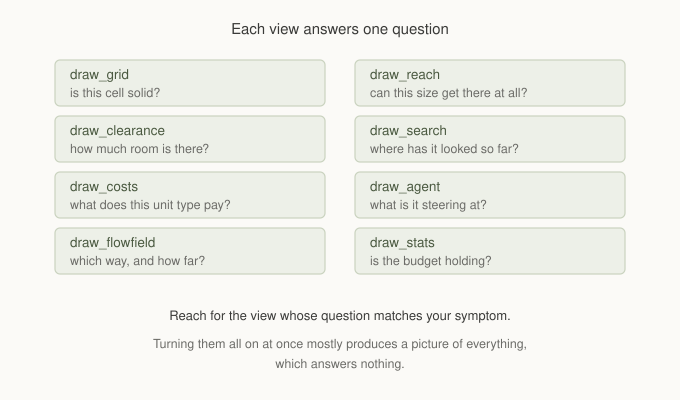

# Chapter 19: Seeing What The Navigation Thinks

Almost everything in this series is invisible.

A clearance map is an array of small integers. A cost profile is another array.
A flow field is two more, plus a third nobody looks at. The one thing you can
normally see is the agent, and the agent is the end of a long chain of decisions
any one of which could be the reason it is behaving oddly.

That is why the last chapter is about looking rather than doing. Not because
debug drawing is an afterthought, but because a navigation system you cannot
inspect is one you tune by guessing.

## Each view answers one question



The temptation with a debug renderer is to turn everything on. It produces a
colourful picture that is very hard to read and almost never isolates anything.

The better habit is to start from the symptom and pick the view whose question
matches it. A unit refusing a route that looks fine is a reach question. A unit
taking a strange but valid route is a cost question. A unit stuttering is an
agent question. One view at a time, and the answer usually arrives immediately.

```gml
cfg = gmnav_debug_config();

gmnav_debug_draw_grid(grid, cfg);
gmnav_debug_draw_clearance(grid, cfg);
gmnav_debug_draw_costs(grid, profile, cfg);
gmnav_debug_draw_flowfield(field, cfg);
gmnav_debug_draw_reach(grid, cfg);
gmnav_debug_draw_search(search, cfg);
gmnav_debug_draw_agent(agent, cfg);

gmnav_debug_draw_stats(sched, 8, 8);   // in a Draw GUI event
```

## Layers draw where they sit

Every view understands overlays. A deck, a ramp, a flyover draws at the height
it actually occupies, with a thin line dropping to the ground cell beneath it so
you can tell which column it belongs to.

That last detail matters more than it sounds. A raised cell drawn in isolation
tells you nothing about what it is above, and "which cell is this bridge over"
is exactly the question you have when a route is doing something unexpected near
one.

The colour ramps include overlay values when working out their range, so a deck
is shaded on the same scale as the ground rather than against a maximum it never
contributed to.

## The one that answers the hardest question

`gmnav_debug_draw_reach` is new, and it exists for the failure that wastes the
most time.

A search returns `FAILED`. The map looks fine. The route looks obvious. Nothing
is blocked that should not be.

```gml
gmnav_debug_draw_reach(grid, cfg);
gmnav_debug_draw_reach(grid, cfg, 2);   // for a unit needing clearance 2
```

It colours each connected component differently. One colour means everything
reachable from everything else. Two colours mean your map is in two pieces, and
you can see exactly where the seam is.

The clearance argument is the part worth knowing about. A map that is one
component for a rat can be five islands for an ogre, because a doorway one cell
too narrow is a wall to anything that does not fit. Chapter 7 described that
failure. This is what it looks like.

The view walks authored links as well as ordinary adjacency, so a deck joined by
stairs reads as part of the floor it connects to rather than as an island of its
own. If a bridge shows up in a different colour from the ground at both its
ends, its links are missing, which is a level authoring bug the search would
otherwise report as a mysterious `FAILED`.

## Reading the flow field view

Chapter 8 gave the rule and it is worth repeating, because it is the fastest
diagnosis in the framework.

**Any arrow pointing into a wall means the field is wrong, not the steering.**

Arrows on a flow field are computed in world space, which is why they are
trustworthy on isometric and hex maps where a cell offset is not a screen
direction. If they look right and your units still walk into geometry, the
problem is downstream. If they look wrong, stop looking at your movement code.

The distance shading is the other half. A field that reaches every cell you
expect, shading smoothly outward from the goal, is working. A hard edge where
the shading stops is either a distance cap or a genuine unreachable region, and
which one it is will be obvious from where it sits.

## Reading the agent view

The agent view draws its path, a solid ring on the waypoint it is steering at, a
fainter ring on the next real corner, its body, and its velocity.

The solid ring is the diagnostic one. It sits on the waypoint currently being
targeted, not on where the agent is going next in a broader sense, and that is
deliberate. An agent whose ring never advances is not making progress toward it.
An agent whose ring advances every frame is passing waypoints faster than it can
steer at them.

A path drawn with a waypoint in every cell rather than at corners is telling you
smoothing refused those shortcuts. Chapter 13 listed the usual reasons: a body
too wide for the corridor, or a profile making the shortcut dear.

A **red** path rather than the usual colour means it has gone stale and the
agent has not yet replaced it. Briefly is normal. Persistently means repathing
is failing or rate limited harder than you meant.

## The frontier, and why it usually draws nothing

`gmnav_debug_draw_search` renders only while a search holds a workspace. Once it
finishes it releases the slot and the view goes empty.

That is not a bug, it is the point. The view exists to watch a frontier expand
across frames under a small budget, which is how you see whether a search is
spreading sensibly or wandering. Give it a large budget and it completes inside
one frame and there is nothing to watch.

Open cells and closed cells are drawn differently. The leading edge is open, the
region behind it is closed, and the shape of the boundary tells you whether the
heuristic is doing its job. A frontier that spreads evenly in all directions is
behaving like Dijkstra, which usually means the heuristic is zero or the map has
made it useless.

## Stats

```gml
gmnav_debug_draw_stats(sched, 8, 8);
```

This is the one to leave on longest, and the number to watch is **pending**.

A brief spike is a crowd asking at once and the queue doing its job. Pending
that stays high frame after frame means requests are arriving faster than they
are served.

Chapter 17 covered the trap here. Before raising the budget, ask whether those
requests should exist. Permanently high pending on a map with frequent edits is
more often unnecessary repathing than an undersized allowance, and raising the
budget hides it by doing the pointless work faster.

## Two practical notes

**Culling.** The renderer culls to the camera by default, which is what you want
on a large map. In a room with no view enabled there is nothing to cull against,
and the renderer draws everything rather than nothing. If you are deliberately
inspecting off-screen geometry, turn it off:

```gml
cfg.cull = false;
```

**Cell budgets.** Each view stops after a configurable number of cells and logs
that it did. On a very large map with culling off, that is what stands between
you and a frame that takes a second to draw. If a view looks truncated, that is
why.

## Where this ends

Nineteen chapters, and the thread running through the last nine is the same one
that ran through the first ten.

Almost nothing about intelligent looking movement is about the movement. It is
about describing the world honestly enough that the arithmetic produces the
behaviour you wanted. Price the swamp and the path finds the bridge. Price the
danger and the enemy flanks. Give a unit a climb limit and the cliff becomes one
way without anyone writing a rule. Tell the shaping pass which headings a
character can face and its route starts looking like a decision instead of a
calculation.

The debug renderer is where that stops being a claim you take on trust and
becomes something you can look at. Use it early, use one view at a time, and
turn it off before you ship.

Thank you for reading. Go build something that moves well.

## What you've learned

- **Each view answers one question**, and the fastest route to a diagnosis is
  matching the view to the symptom rather than turning everything on.
- **Every view understands overlays**, drawing raised cells at their real height
  with a tick to the ground beneath.
- **`draw_reach` colours connected components**, and with a clearance argument it
  answers what a unit of that size can actually get to.
- **An arrow into a wall means the field is wrong**, not the steering.
- **The agent's solid ring is its real target**, so a ring that never advances is
  an agent making no progress.
- **The frontier view is empty unless a search is in flight**, by design.
- **Watch pending**, and ask whether the requests should exist before raising the
  budget.
- **Culling draws everything when there is no view to cull against**, and each
  view has a cell budget it will tell you about.
