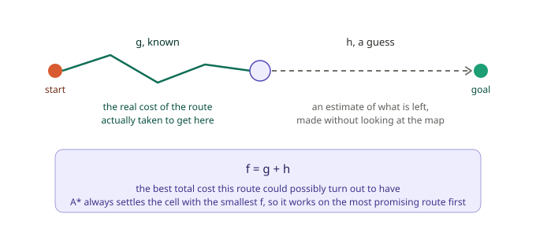
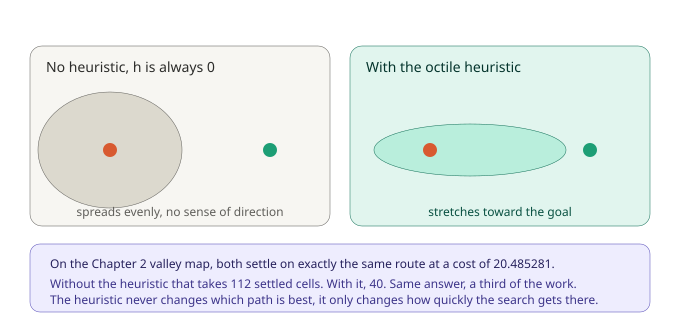
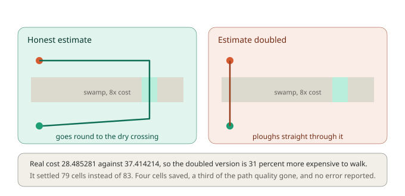
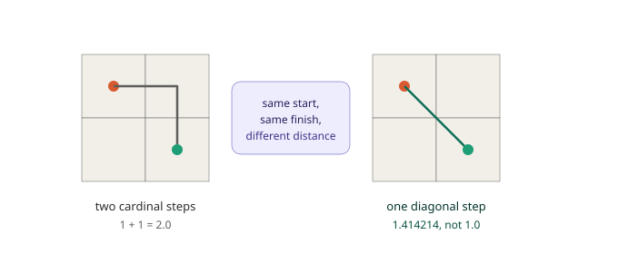
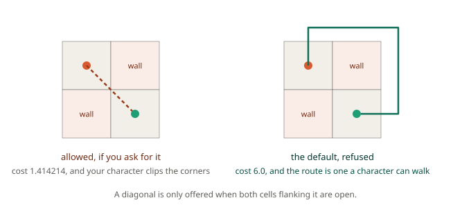

# Chapter 2: How A\* Decides, Cost and Heuristics

In Chapter 1 you asked GMNav for a path and got one. It looked sensible. It went down before it went right, hugged a few pillars diagonally, and arrived. But you took all of that on trust, because nothing in the chapter explained how the framework picked that route over the thousands of others available.

This chapter opens the decision up. By the end you'll know exactly what A\* is comparing when it chooses, why a diagonal step has to cost more than a straight one, how to make a swamp expensive so your paths flow around it, and, most usefully, what silently breaks when the maths stops being honest.

## Two numbers, and one rule

A search algorithm sitting on a cell knows two things about it.

The first is solid fact: **how much the route it actually took to get here has cost so far**. Every step has a price, the search added them up along the way, and there's no guesswork in it. This number is traditionally called **g**.

The second is a guess: **how much it will probably cost to get from here to the goal**. The search hasn't explored that part of the map, so it can't know. But it can estimate, because it knows where the goal is in space, even if it doesn't know what's between. This estimate is called **h**, short for heuristic, which is just a formal word for an educated guess.

Add them and you get **f**, the total cost this route would have *if the guess turns out to be right*.



And here's the entire rule that drives the algorithm: **always settle the cell with the smallest f**.

That's it. That's A\*. Everything else is bookkeeping. The search keeps a pile of reached-but-not-settled cells, repeatedly pulls out whichever has the lowest f, settles it, and adds its neighbours to the pile. When the cell it pulls out is the goal, it's done.

Chapter 1 described this as "always settle the cheapest cell". Now you know what cheapest means: cheapest *total*, counting both what's been spent and what's estimated to remain.

## What the guess is for

It's worth being precise about what h buys you, because it's easy to assume it makes the paths better. It doesn't. It makes the *search* faster and leaves the paths exactly as they were.

Set h to zero everywhere and A\* still works perfectly. With no sense of where the goal is, it just spreads out evenly in every direction until it happens to bump into it. That version has its own name, **Dijkstra's algorithm**, and it predates A\* by about a decade. It gives you the same optimal path, it simply does far more work to find it.



Those numbers are from this chapter's map, which we're about to meet. Same start, same goal, same answer to six decimal places. One settles 112 cells, the other settles 40.

GMNav picks a heuristic automatically based on your layout, and you can see which one it chose:

```gml
search = gmnav_search_create(grid, gmnav_heuristic.AUTO);   // the default
```

On a standard 8-way square grid, `AUTO` resolves to the **octile** heuristic, which is the exact straight-line distance you'd cover if there were no walls at all, counting diagonals at their proper price. There's also `gmnav_heuristic.ZERO`, which turns the search into Dijkstra. That sounds useless, and it mostly is, but it's genuinely valuable for one thing: if you ever suspect A\* is returning a bad path, run the same search with `ZERO` and compare the total cost. Dijkstra is optimal by construction, so if the two disagree, something is wrong with the heuristic rather than with your map.

## A new map: the river valley

For this chapter we're crossing a valley. It's 20 by 14 cells, with solid outer walls, two rock outcrops, and a band of swamp four rows deep running the full width. Cutting through the swamp is a dry crossing two cells wide.

The swamp is the point. It isn't a wall, you *can* walk through it, it just costs eight times as much per step as dry grass. That single idea, ground that's passable but expensive, is what turns pathfinding from a maze solver into something that produces believable movement.

```gml
var _map = chapter2_get_map();

layout = gmnav_layout_create(gmnav_layout.ORTHO, _map.tile, _map.tile);
grid   = gmnav_grid_create(_map.width, _map.height, layout);

chapter2_apply_walls(grid);
chapter2_apply_terrain(grid);
```

Terrain cost is set per cell, and it's a multiplier on whatever a step into that cell would otherwise have cost:

```gml
gmnav_grid_set_cost(grid, 7, 6, 8);   // this cell costs 8x to enter
```

Note the direction: the cost belongs to the cell you're moving *into*, not the one you're leaving. Entering swamp is expensive; leaving it is free.

### Watch the swamp change the answer

Run the search from (2,2) to (17,11) on a flat map where everything costs 1, and you get:

```
cost 18.727922, 16 cells
(2,2) (3,3) (4,3) (5,3) (6,3) (7,3) (8,3) (9,3) (10,4) (11,5) (12,6) (13,7) (14,8) (15,9) (16,10) (17,11)
```

A clean diagonal run, straight through the middle of the valley. Now apply the terrain and run the identical search again:

```
cost 20.485281, 19 cells
(2,2) (3,3) (4,3) (5,3) (6,3) (7,3) (8,3) (9,3) (10,4) (11,4) (12,4) (13,4) (14,5) (14,6) (14,7) (14,8) (15,9) (16,10) (17,11)
```

Look at what changed. The path now runs along row 4, just above the swamp, all the way to column 14, then drops straight down the dry crossing before continuing. It crosses **zero** swamp cells. Not one.

It's also three cells longer and, in raw distance, a worse route. That's correct and it's the whole idea: the path got longer in metres and cheaper in effort, which is exactly the trade a real traveller makes when they walk to the bridge instead of wading the river.

**A detail worth internalising:** you didn't tell GMNav to prefer the bridge. There's no bridge logic anywhere. You said "swamp costs eight", and the route came out of the arithmetic. Almost everything that makes AI movement look thoughtful is produced this way, by pricing the world honestly and letting the search do what it already does.

## The rule the guess has to obey

Here's the part that matters most in this chapter, because it's the one thing that will silently ruin your paths if you get it wrong.

The heuristic is allowed to be wrong. It's a guess, it's supposed to be wrong. But it's only allowed to be wrong in **one direction**: it may underestimate the remaining cost, and it must never overestimate it. A heuristic that respects this is called **admissible**.

The reason is worth understanding rather than memorising. A\* stops the moment the goal has the smallest f in the pile, on the grounds that no other route could possibly beat it. That reasoning only holds if every other route's f is a genuine lower bound on what that route would really cost. If some cell's h is too high, its f is too high, the search shrugs and looks elsewhere, and it may skip past the actual best route without ever examining it.

Suppose you decide the search feels slow and multiply the heuristic by two. Same valley map, this time heading from (2,2) down to (3,11) in the bottom-left corner:



The honest search costs **28.485281** and settles 83 cells. It goes all the way right to the crossing, over, and back along the bottom, avoiding the swamp completely.

The doubled search costs **37.414214** and settles 79 cells. It marches straight down column 3, through four cells of swamp.

Read those two numbers together, because they're the lesson. You bought a saving of four settled cells, roughly five percent, and paid for it with a route that costs thirty-one percent more to walk. The doubled path even *looks* better in the debug renderer, it's a tidy straight line of 10 cells against a rambling 27, which makes the failure genuinely hard to spot by eye. And nothing anywhere reported a problem, because from A\*'s point of view nothing went wrong. It answered the question it was asked, using the numbers it was given.

This is why GMNav doesn't expose a heuristic weight. It's the classic tuning knob in pathfinding literature, and it's also the classic way to end up with quietly bad paths.

### The same rule, from the other end

Admissibility can be broken from the cost side too, and this one people hit by accident.

If you have roads that should be faster than grass, the instinct is to give the road a cost of 0.5. GMNav won't let you. `gmnav_grid_set_cost` clamps at 1, and the clamp is not a limitation, it's the same guarantee viewed from the other side. The octile heuristic assumes every step costs at least 1. Let a cell cost less than that, and the heuristic starts overestimating without anyone touching it.

So express it the other way around:

```gml
// wrong, and silently clamped back to 1
gmnav_grid_set_cost(grid, _c, _r, 0.5);

// right, roads stay at 1 and everything else gets more expensive
gmnav_grid_set_cost(grid, _grass_c, _grass_r, 2);
```

Same relationship, same paths, admissibility intact. Cheapest-thing-is-1 is a habit worth adopting from the start, because retrofitting it into a finished map is tedious.

## Diagonals, and the price of one

We've been quietly assuming diagonal steps cost 1.414214 without saying why, so let's say why.



If diagonals were priced at 1 like everything else, a diagonal step would be a bargain, it covers 1.41 tiles of ground for the price of 1. A\* would notice immediately and every path in your game would become a staircase, zigzagging diagonally wherever it could, because that's genuinely the cheapest thing under those rules. Pricing diagonals at the square root of two makes cost and distance agree again.

If you'd rather have no diagonals at all, which suits grid-locked tactical movement, say so in the layout:

```gml
layout = gmnav_layout_create(gmnav_layout.ORTHO, 32, 32, gmnav_neighbours.FOUR);
```

GMNav will then automatically switch the heuristic from octile to Manhattan, because octile would overestimate on a 4-way grid, and we've just spent a page on why that matters.

## The gap that isn't a gap

One last piece of geometry. Put two walls diagonally opposite each other and the cells between them are technically adjacent, so a diagonal step between them is technically legal:



It's also physically nonsense. There's no actual opening there, just a mathematical one, and a character taking that step will clip through both wall corners.

GMNav refuses this by default. A diagonal is only offered when both cells flanking it are open. On the pinch in this chapter's dataset, that turns a 1.414214 squeeze into a 6.0 detour, and the detour is the route a character can genuinely walk.

You can turn it off if your game wants it, some top-down shooters and roguelikes deliberately allow corner cutting:

```gml
gmnav_search_begin(search, _from, _to, true);   // fourth argument allows cutting
```

Just be aware you're now responsible for a character that will occasionally slide through wall corners.

## What you've learned

- **g, h and f**: cost already spent, estimated cost remaining, and their sum. A\* always settles the cell with the smallest f, and that single rule is the whole algorithm.
- **What the heuristic is for**: not better paths, faster searches. Same route at 20.485281, found in 40 settled cells instead of 112.
- **Terrain cost**: a multiplier on entering a cell, which turns walls-versus-floor into something much more expressive. Price the swamp honestly and the path finds the bridge on its own.
- **Admissibility**: the estimate may underestimate but must never overestimate. Break it and you get worse paths, no error message, and a route that often looks tidier than the correct one.
- **The cost floor of 1**: the same guarantee from the cost side. Make roads fast by making everything else slow, never by dropping below 1.
- **Diagonal pricing and corner cutting**: 1.414214 keeps cost honest against distance, and refusing the diagonal squeeze keeps paths walkable.

## What's next

Every search in these first two chapters has been run with a budget of 100000, which is a polite way of saying "finish the whole thing right now, however long it takes". On a small map with one search, nobody notices.

Now picture forty enemies in a large level, all requesting a path on the same frame because the player just triggered an alarm. Every one of those searches runs to completion before your game gets to draw anything. That frame is gone, and the next one, and players will feel it.

In **Chapter 3** we get to the reason GMNav exists at all. You'll learn what it means for a search to stop halfway and resume later, how a single shared budget keeps two hundred agents costing the same as ten, how priorities let an urgent request jump the queue without starving anyone, and why the function named `IMMEDIATE` is not the promise it appears to be.

See you there.
