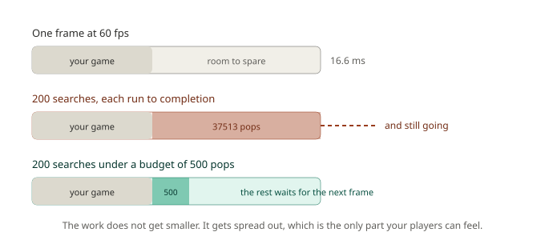
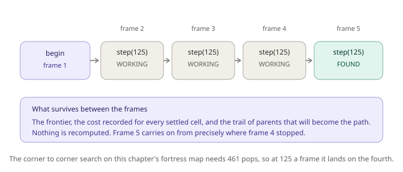
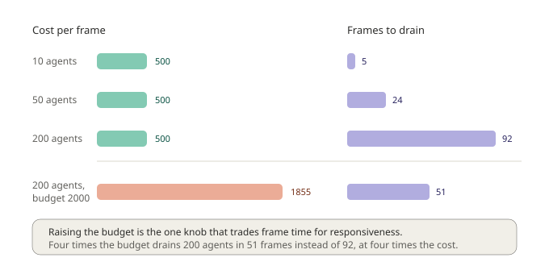
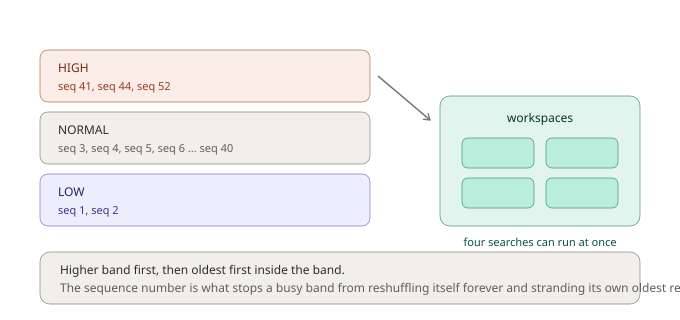
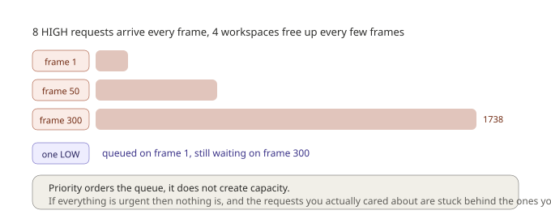

# Chapter 3: The Frame Problem, Budgets and the Scheduler

Both chapters so far have quietly done something you should never do in a shipped game.

```gml
gmnav_search_step(search, 100000);
```

That budget of 100000 means "keep going until you're finished, whatever it takes". On a small map with a single search it's harmless, and it kept the first two chapters focused on pathfinding rather than plumbing. It's also the single fastest way to make your game stutter.

This chapter is about why, and about the answer GMNav is built around. It's the chapter that explains the framework's existence, so if you only properly read one, make it this one.

## Sixteen milliseconds

A game running at 60 frames per second has 16.6 milliseconds per frame to do everything: input, physics, collision, animation, drawing, audio, and your own game logic. Miss that window and the frame is late, which players perceive as a hitch.

Now put forty guards in a fortress and have the player trip an alarm. Every guard asks for a path on the same frame. Every one of those searches runs to completion before your game continues.



Those numbers are measured, not guessed. On this chapter's fortress map, one corner-to-corner search pops **461** entries off the heap and settles 313 cells. Two hundred agents all searching at once come to **37,513 pops in a single frame**, roughly eighty-one times the cost of one search, landing in the same 16.6 milliseconds that also had to draw your game.

You cannot make that frame fit by optimising the search. Even if you made A\* twice as fast, forty of them still land at once, and the eighty-first agent still ruins everything. The problem isn't that any single search is slow. It's that the total work is unbounded and it all arrives at the same instant.

## Stopping halfway

The fix is to stop insisting that a search finish before your game continues.

Look again at the shape you've been using since Chapter 1, and notice that it was never a single function call:

```gml
gmnav_search_begin(search, _from, _to);
var _state = gmnav_search_step(search, 100000);
```

`begin` sets a search up. `step` advances it by a limited amount of work and returns what happened. Pass a small budget and it does a little, returns `gmnav_state.WORKING`, and stops. Call it again next frame and it carries on from exactly where it left off.



This is a **resumable search**, and it is the core primitive of GMNav. Everything else in the framework is arranged around it.

The thing that makes it work is that the search's state survives between calls. Its frontier, the cost recorded for every settled cell, and the trail of parent links that will eventually become the path all sit in a workspace that stays alive while the search sleeps. Nothing is thrown away and nothing is recomputed. The search doesn't know or care that four frames passed between two of its steps.

That corner-to-corner search needs 461 pops. At 125 pops a frame it finishes on the fourth frame, having cost your game a quarter of a search each time instead of a whole one at once.

## The budget belongs to the game, not the agent

Here's the design decision that matters, and it's easy to get backwards.

The obvious approach would be to give every agent its own budget: each search gets, say, 50 pops per frame. That's still broken. Forty agents now cost 2,000 pops per frame and two hundred cost 10,000. You've smoothed the spike into a slope, but frame cost still grows with agent count, and it still eventually exceeds what you have.

GMNav shares **one** budget across every search in flight. The **scheduler** owns it.

```gml
sched = gmnav_scheduler_create(grid, 500, 4);
```

That's a scheduler with 500 pops to spend per frame, running at most 4 searches at a time. You ask it for paths instead of driving searches yourself:

```gml
ticket = gmnav_scheduler_request(sched, _from, _to);
```

and you step it once per frame:

```gml
gmnav_scheduler_update(sched);
```

A **ticket** is a receipt, not a path. It comes back immediately, before any work has happened, and you check it later:

```gml
if (gmnav_scheduler_is_ready(ticket)) {
    var _path = gmnav_scheduler_get_path(ticket);
}
```

Now watch what that buys you. Same fortress map, same scheduler settings, three different crowd sizes:



The left column is the point. **Peak cost per frame is 500 pops whether ten agents are asking or two hundred.** It's 500 because you said 500. Agent count doesn't appear in that number anywhere.

What agent count changes is the right column: how long the queue takes to drain. Ten agents are all served within 5 frames. Two hundred take 92 frames, about a second and a half. Nobody's frame rate moved.

That trade, *responsiveness degrades gracefully instead of frame rate falling off a cliff*, is the entire proposition. A guard who takes an extra second to work out its route looks like a guard who hesitated. A game that drops to 20 fps looks broken.

If a second and a half is too long, raise the budget. The bottom row shows 200 agents at a budget of 2000: 51 frames instead of 92, at nearly four times the per-frame cost. That's the one knob, and it's an honest trade in both directions.

### Knowing which way to turn the knob

The scheduler tells you which side of that trade you're on:

```gml
gmnav_debug_draw_stats(sched);   // in a Draw GUI event
```

The number to watch is **pending**. A brief spike is normal, it means a crowd just asked at once and the queue is doing its job. Pending that stays high frame after frame means requests are arriving faster than you're serving them, and the queue will grow without limit. Raise the budget, or raise the number of workspaces, or ask for fewer paths.

## Workspaces, and why there are only four

The third argument to `gmnav_scheduler_create` is the number of searches allowed to run simultaneously, and it's capped by something physical.

Every in-flight search needs its own workspace: three arrays sized to your cell count, holding costs, parents, and visit marks. Those are allocated once by the grid and lent out. On a 500 by 500 map, four workspaces is around 24 MB. Forty would be 240 MB, for no benefit at all, since they'd all be sharing the same 500 pops anyway.

So the grid owns a small pool:

```gml
grid = gmnav_grid_create(40, 30, layout, 4);   // fourth argument, default 4
```

and the scheduler quietly caps its concurrency at whatever the grid can supply. A search that can't get a workspace simply waits in the queue.

**Running four at a time rather than one is worth it** for a reason that isn't obvious: a search that finishes early hands its unused budget to the next one in the same frame. With one search at a time, a request needing 30 pops would waste the other 470. Splitting the budget four ways and cascading the leftovers keeps the whole allowance working.

## Priority, and what it actually promises

Not every path request matters equally. A guard who spotted the player needs a route now. A civilian wandering toward a market stall can wait.

```gml
gmnav_scheduler_request(sched, _from, _to, gmnav_priority.HIGH);
```

The queue is sorted into bands, and within each band the oldest request goes first:



That second rule matters more than it looks. Sorting by priority alone means that when a fresh request arrives with the same priority as one that's been waiting for two seconds, nothing distinguishes them, and the queue can keep reshuffling around its own oldest member. The sequence number breaks the tie by age, so a band always drains in the order it filled.

Measured on the fortress map: with 40 NORMAL requests already queued, a HIGH request arriving on frame 3 completed on frame 7. When it finished, **27 of the 40 NORMALs were still waiting**. Everything drained by frame 19. The urgent request jumped roughly thirty places and cost the queue four frames.

And with 31 requests all at NORMAL, the first one queued finished on frame 4, with 18 of the 30 behind it finishing later. Order held.

### The part priority does not promise

Here's the honest limitation, and it's worth internalising before you start labelling things HIGH.

Priority orders the queue. It does not create capacity. If high-priority requests arrive faster than workspaces free up, the backlog grows without limit, and anything below them never reaches the front at all.



Eight HIGH requests per frame against four workspaces, on this chapter's map: after **300 frames the backlog had grown to 1,738 requests** and a single LOW request queued on frame 1 had still never run. Not delayed, never started.

The lesson isn't that priorities are broken, it's that they're relative. If every request in your game is HIGH, you have exactly the queue you'd have had with no priorities at all, plus the false confidence that the important ones are being handled. Reserve HIGH for genuinely urgent, genuinely rare things, and let the ordinary traffic be NORMAL.

## IMMEDIATE is not a promise

There's a fourth priority, and its name oversells it:

```gml
gmnav_scheduler_request(sched, _from, _to, gmnav_priority.IMMEDIATE);
```

This bypasses the budget entirely and runs the search to completion inside the call. The ticket comes back already resolved. It's genuinely useful for one-off, out-of-gameplay situations: placing an NPC at level start, a menu previewing a route, a cutscene.

What it does **not** bypass is the workspace pool. It still needs somewhere to run, and if four searches are already mid-flight holding all four workspaces, there is nowhere. When that happens, the request quietly falls back into the queue and resolves later like any other.

So this is a bug waiting to happen:

```gml
var _t = gmnav_scheduler_request(sched, _a, _b, gmnav_priority.IMMEDIATE);
var _path = gmnav_scheduler_get_path(_t);   // may be empty, and you did not check
```

and this is correct:

```gml
var _t = gmnav_scheduler_request(sched, _a, _b, gmnav_priority.IMMEDIATE);

if (_t.state == gmnav_state.FOUND) {
    var _path = gmnav_scheduler_get_path(_t);
} else {
    // either impossible, or the pool was full and it is now queued.
    // check the ticket again on a later frame.
}
```

Using IMMEDIATE during normal gameplay also defeats the budget, which is the thing you set up the scheduler for. If you find yourself reaching for it in a Step event, that's usually a sign the design wants a normal request and a bit of patience instead.

## Cancelling

Agents change their minds. The player moves, the guard loses sight of them, the target dies. A request already in flight can be abandoned:

```gml
gmnav_scheduler_cancel(sched, ticket);
```

Cancelling frees the workspace on the next update and lets a waiting request take it. In a game where targets move often, cancelling stale requests is a real performance win, not just tidiness. It's also safe at any point, whether the ticket is queued, running, or already finished.

## What you've learned

- **The frame problem**: a search that runs to completion costs whatever it costs, and N agents cost N times that, all landing in one frame. 200 searches on this chapter's map come to 37,513 pops at once.
- **Resumable search**: `begin` once, `step` a little each frame. The frontier, costs and parent links survive in a workspace between calls, so nothing is recomputed.
- **A shared budget**: one allowance for the whole game, not one per agent. Peak cost stayed at 500 pops per frame for 10, 50 and 200 agents alike. Only the drain time changed, 5 frames against 92.
- **Workspaces**: each in-flight search needs its own memory, so concurrency is small and deliberate. Unused budget cascades between them so nothing is wasted.
- **Priority bands with FIFO inside them**: an urgent request jumped 30 places and arrived 4 frames later, while ordinary ones kept their order.
- **What priority cannot do**: it orders a queue, it doesn't add capacity. At 8 urgent requests per frame against 4 workspaces, the backlog reached 1,738 and a low-priority request never ran at all.
- **IMMEDIATE bypasses the budget, not the pool**: check the ticket state rather than assuming a path arrived.

## What's next

You now have paths arriving reliably without hurting your frame rate. What you don't have is anything that moves.

A path is an array of integers. A character is a thing at a position with a velocity, which needs to know which waypoint it's heading for, when it has arrived, what to do when the path it's following turns out to be a staircase of single-cell steps, and how not to end up standing inside three other guards who all took the same route.

In **Chapter 4** we close that gap. You'll learn how node IDs become world-space waypoints, why the raw path has far more corners than it needs and how string pulling removes them, why the line-of-sight test behind that has to visit every cell a line touches (and what breaks in a subtle, corner-clipping way when it doesn't), and how GMNav's agent layer follows a path while deliberately refusing to move your instances for you.

See you there.
