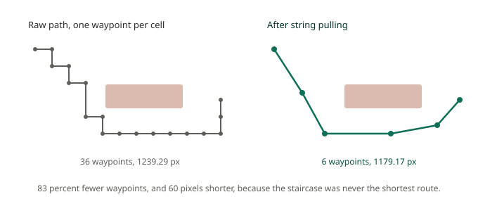
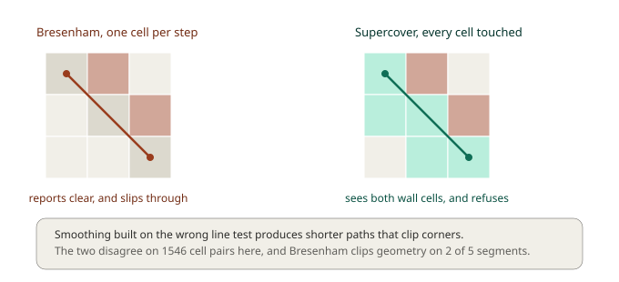
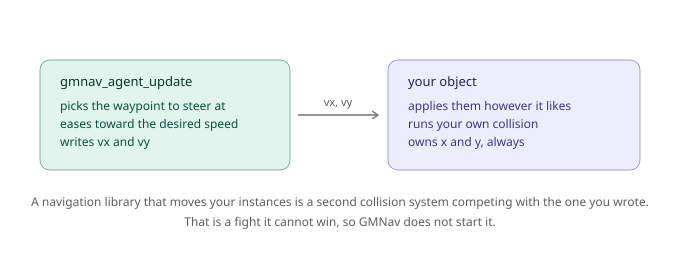
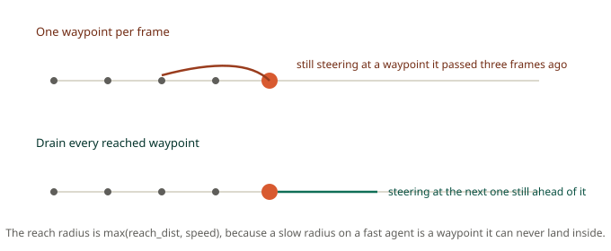

# Chapter 4: From Nodes to Movement, Paths and Agents

Three chapters in, you can ask for a path and get one back without hurting your frame rate. What you get is this:

```
[31, 62, 92, 122, 152, 182, 213, 244, 245, 246, ...]
```

An array of integers. Nothing in your game moves. Between that array and a guard walking down a corridor there's a surprising amount of work, and this chapter does all of it.

By the end you'll know why the raw path has six times more corners than it needs, how to remove them safely, what breaks when the removal is done with the wrong geometry test, and how GMNav's agent layer follows a path while deliberately refusing to move your instances for you.

## A new map: the warehouse

Three double rows of shelving, a corridor down the middle, clear aisles on both sides. 30 by 20 cells, 396 of them walkable.

```gml
var _map = chapter4_get_map();

layout = gmnav_layout_create(gmnav_layout.ORTHO, _map.tile, _map.tile);
grid   = gmnav_grid_create(_map.width, _map.height, layout);

chapter4_apply_walls(grid);
```

The patrol route we'll use runs corner to corner, from (1,1) down to (28,18). It comes back as **36 cells**, at a cost of 38.727922 and a real world length of **1239.29 pixels**.

Keep the map in mind. Chapter 9 comes back to this exact warehouse and starts knocking holes in it while agents are mid-journey.

## From cells to positions

Node IDs are grid bookkeeping. Your character needs pixels. A **path object** does that conversion and holds the result:

```gml
path = gmnav_path_create(grid, gmnav_search_get_path(search));

path.count             // how many waypoints
gmnav_path_get_x(path, 0)   // world x of waypoint 0
gmnav_path_get_y(path, 0)   // world y
gmnav_path_get_length(path) // total world length
```

Every waypoint sits at the centre of its cell, which introduces a small problem straight away. Your character is almost never standing exactly on a cell centre, so the first waypoint is slightly behind it, and the agent's opening move is a visible snap backwards.

Two calls fix it:

```gml
gmnav_path_anchor_start(path, x, y);              // where the character really is
gmnav_path_anchor_end(path, target_x, target_y);  // where the target really is
```

These overwrite the first and last waypoints with real positions and recompute the length. The agent layer does both automatically, but if you're driving paths yourself, do them.

## The staircase

Look at the raw route and you'll see the problem immediately:

```
(1,1) (2,2) (2,3) (2,4) (2,5) (2,6) (3,7) (4,8) (5,8) (6,8) (7,8) (8,8)
(9,8) (10,8) (11,8) (12,8) (13,9) (14,10) (15,11) (16,12) (17,12) ...
```

There's a run of eight cells all on row 8, and another of nine on row 12. Those aren't corners, they're a straight line chopped into pieces by the grid. A character following them turns very slightly, thirty-six times, on a journey with about four real corners in it.

**String pulling** removes them. The idea is simple: from your current waypoint, look as far ahead as you can still see in a straight line, jump directly there, and repeat.

```gml
gmnav_path_smooth(path);
```



On our patrol route: **36 waypoints become 6**, and the world length drops from 1239.29 to **1179.17 pixels**.

That the path got *shorter* is worth pausing on. The staircase was never the shortest route between those points, it was the shortest route *that follows cell centres*. Once you stop insisting on that, sixty pixels of unnecessary zigzag disappear. A\* wasn't wrong, it answered the question it was asked, on the graph it was given.

There's a second, cheaper tool for when you can't smooth:

```gml
gmnav_path_simplify(path);
```

This only removes waypoints that lie on a straight line between their neighbours. It changes the path's shape not at all, so it's safe on every layout including the ones smoothing refuses. On the raw patrol route it takes 36 waypoints down to **11**, which is most of the win for none of the risk. One caveat: after simplifying, the waypoints no longer correspond one-to-one with cells, so `path.nodes` is cleared. Run `smooth` first if you want both.

## The test underneath

"Look as far ahead as you can still see" needs a definition of *see*, and this is where a subtle bug lives in a lot of hand-rolled smoothing.

The obvious tool is Bresenham's line algorithm, the standard way to draw a line on a grid. It picks exactly one cell per step along the major axis, which is right for drawing and wrong for this.



Because Bresenham commits to one cell per step, a line passing exactly through the corner between two diagonal walls slips through the gap without ever visiting either wall cell. It reports clear. The smoothed path then cuts that corner, and your character walks through solid geometry.

GMNav uses a **supercover** walk instead, which visits every cell the line touches, and adds an explicit check at exact-corner crossings requiring both flanking cells to be open:

```gml
if (gmnav_grid_line_clear(grid, 5, 3, 12, 9)) {
    // a character can walk that straight line
}
```

On this chapter's warehouse the two tests disagree on **1546 cell pairs**. Smoothing the patrol route with Bresenham gives a path 3 pixels shorter, and **2 of its 5 segments pass through shelving**. Shorter, and wrong.

This is a good example of a bug that never crashes, never logs anything, and gets reported to you as "sometimes the enemies clip the shelves a bit".

**Smoothing is refused on some layouts.** On staggered isometric and hex grids, a straight line in cell coordinates doesn't correspond to a straight line on screen, so a line-of-sight test in cell space says nothing useful about whether a character could walk it. `gmnav_path_smooth` detects those layouts and returns without doing anything, rather than returning a confidently wrong answer. `gmnav_path_simplify` works everywhere. Chapter 5 explains why.

## The agent

You now have a smoothed path in world coordinates. Following it means tracking which waypoint you're heading for, easing toward it rather than snapping, slowing down on arrival, and coping with a path that gets replaced mid-journey.

That's the agent layer:

```gml
// Create
sched = gmnav_scheduler_create(grid, 2000, 4);
agent = gmnav_agent_create(sched, x, y, 12, 3);   // radius 12, speed 3
```

```gml
// Step
gmnav_scheduler_update(sched);
gmnav_agent_update(agent);

x += agent.vx;
y += agent.vy;
```

```gml
// Anywhere
gmnav_agent_goto(agent, target_x, target_y);
```

`gmnav_agent_goto` requests a path from the scheduler. When it arrives, the agent picks it up, smooths it, anchors both ends, and starts steering. You never touch a ticket.

### The contract

Look again at the Step event, because those two lines are the most important thing in this chapter.



`gmnav_agent_update` writes `vx` and `vy`. It does not write `x` or `y`. Ever.

That's deliberate, and it isn't shyness. Your game already has collision handling, whatever form it takes, and a navigation library that moved instances directly would be a second movement system racing the first. Your collision pushes the character out of a wall, the library puts it back, and you get jitter that's genuinely unpleasant to debug. By proposing a velocity and stopping, GMNav stays advisory. You can clamp it, scale it, ignore it while the character is stunned, or run it through `move_and_collide`. It's your velocity.

### Arrival

Two distances shape how an agent finishes:

```gml
agent.arrive_dist = 24;   // start easing off inside this range
agent.reach_dist  = 4;    // close enough, we are done
```

Between them you get deceleration rather than a character travelling at full speed and stopping dead.

Arrival is latched, so you can ask about it whenever suits you:

```gml
if (gmnav_agent_arrived(agent)) {
    gmnav_agent_goto(agent, next_patrol_x, next_patrol_y);
}
```

The flag stays true until the next `goto` or `stop`, which is what makes patrol routes trivial. It's specifically *not* derived from whether the agent currently has a path, because the path is cleared on the same frame the journey completes, and anything reading that would miss the moment entirely.

Measured on the patrol route at speed 2, the agent arrives in **599 frames**, stopping 3.66 pixels from the goal, inside the 4 pixel reach distance. On the unsmoothed path the same journey takes **629 frames**, because it's chasing thirty extra corners.

### Fast agents

There's a subtlety that only shows up at speed. If waypoints are 20 pixels apart and your agent moves 30 pixels per frame, it passes several waypoints in a single step.



Advance one waypoint per frame and the agent falls further behind its own path each frame, steering at points it has already gone past, curving backwards. GMNav drains *every* reached waypoint in the same update, and uses a reach radius of `max(reach_dist, speed)`, because a 4 pixel radius on an agent that moves 12 pixels per frame is a target it can never land inside, so it orbits forever.

At speed 4 our patrol takes 301 frames on the smoothed path against 319 on the raw one, with no orbiting in either case.

## Crowds

Agents that pathfind independently to the same place will happily stand inside each other. Pass the neighbours you care about and they'll push apart:

```gml
var _near = [];
with (obj_guard) array_push(_near, agent);

gmnav_agent_update(agent, _near);
```

```gml
agent.avoid_str   = 1.0;   // 0 turns it off
agent.avoid_range = 3.0;   // in multiples of radius
```

The push falls off with distance, is strongest at contact, and is clamped so avoidance can never make an agent exceed its own speed.

**Here's the honest limit.** This is *separation*, not true reciprocal avoidance. It stops crowds from stacking into one pixel, which is what most games need. It will not resolve two agents walking directly into each other in a one-tile corridor: both push symmetrically, both stall, and neither yields. Solving that properly needs each agent to reason about the others' intended velocities, which is a different algorithm (ORCA) and not in this release.

If your game has narrow corridors and two-way traffic, plan for that at the design level, wider passages, one-way routes, or letting agents pass through each other, rather than expecting separation to sort it out.

## What you've learned

- **Path objects** convert node IDs into world waypoints, and anchoring both ends stops the opening snap backwards.
- **String pulling** removed 83 percent of the waypoints on our patrol route and made it 60 pixels *shorter*, because the staircase was never the shortest route, only the shortest one following cell centres.
- **`simplify` is the safe fallback**: it drops collinear waypoints only, works on every layout, and took 36 down to 11 with no shape change.
- **The line test matters**: Bresenham skips past wall corners and produces smoothed paths that clip geometry. Supercover visits every touched cell. On this map they disagree 1546 times, and 2 of Bresenham's 5 segments cut through shelving.
- **The agent proposes a velocity and never moves your instances**, so it can't fight the collision code you already wrote.
- **Arrival is latched**, so patrol loops are a single `if`. Fast agents drain every reached waypoint per frame rather than one, or they curve backwards chasing their own tail.
- **Avoidance is separation**: good for crowds, useless for head-on corridor deadlock, and honest about the difference.

## What's next

Everything so far has assumed square tiles viewed from directly above. Plenty of games aren't that. Isometric RPGs, hex-based strategy games and staggered tactics grids all need pathfinding too, and the usual answer is a second, separate system with its own bugs.

GMNav's answer is that the search never touches pixels at all. It walks logical cell coordinates, and the layout translates those to the screen. Change the layout, and isometric and hex come out of the same search code that produced everything in this chapter.

In **Chapter 5** we'll go through all five layouts, the coordinate transforms behind them, why a heuristic measured in screen distance quietly breaks A\* on non-square tiles, why smoothing refuses to run on some of them, and a genuine surprise in staggered isometric adjacency that will catch anyone who draws a wall the obvious way.

See you there.
