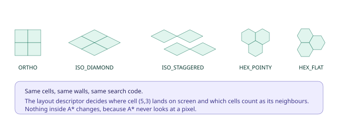
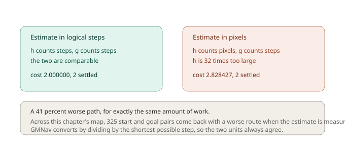
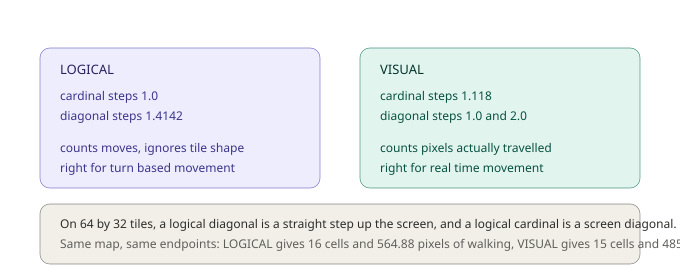
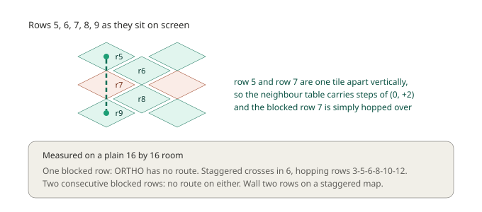

# Chapter 5: Beyond Square Grids, Isometric and Hex

Every map so far has been squares seen from directly overhead. Plenty of games aren't.

Isometric RPGs, hex-based strategy games, staggered tactics grids: all of them need pathfinding, and the usual answer is a second navigation system written from scratch with its own coordinate maths and its own fresh bugs.

GMNav takes a different route, and it rests on something you've already seen without it being pointed out. Look back at any search code from the last four chapters and try to find a pixel in it. There isn't one. A\* has never known how big your tiles are or what shape they are. It walks `(col, row)` pairs and asks a neighbour table what connects to what.

That means isometric and hex aren't a different algorithm. They're a different **layout descriptor** handed to the same search.

## One map, five worlds

This chapter uses a single 16 by 16 logical map, one long wall with a gap near the bottom and a spur sticking out. The cells never change. Only the layout does.



```gml
grid = chapter5_build(gmnav_layout.ISO_DIAMOND);   // or ORTHO, HEX_POINTY, ...
```

Under the hood that's one call with different arguments:

```gml
layout = gmnav_layout_create(
    gmnav_layout.ISO_DIAMOND,   // mode
    64, 32,                     // tile width and height
    gmnav_neighbours.EIGHT,     // how many directions
    gmnav_costmode.LOGICAL,     // how steps are priced
    0, 0                        // world origin of cell (0,0)
);
```

Search the same start and goal across all five and you get:

| Layout | Cells | Cost | Settled |
|---|---|---|---|
| `ORTHO` | 12 | 12.242641 | 21 |
| `ISO_DIAMOND` | 12 | 12.242641 | 21 |
| `ISO_STAGGERED` | 14 | 23.354102 | 30 |
| `HEX_POINTY` | 14 | 13.196048 | 35 |
| `HEX_FLAT` | 12 | 11.000000 | 11 |

**Look at the first two rows.** Orthogonal and isometric diamond produce byte-identical results, right down to the cost. That isn't a coincidence or an approximation. Diamond isometric is the *same graph* as a square grid, drawn rotated. Cell (5,3) has exactly the same eight neighbours in both. Only the screen positions differ:

| Layout | cell (5,3) | cell (3,5) |
|---|---|---|
| `ORTHO` | (176, 112) | (112, 176) |
| `ISO_DIAMOND` | (64, 128) | (-64, 128) |
| `HEX_POINTY` | (176, 81) | (112, 135) |

In orthogonal, swapping column and row swaps x and y. In isometric, those two cells sit at the same height on screen, mirrored left and right. Same cells, same search, different picture.

The other three genuinely differ, because their neighbour tables differ. Hex cells have six neighbours instead of eight. Staggered rows are offset, so which cells touch depends on whether a row is even or odd.

## Getting cells and pixels straight

Two functions convert, and you'll want both:

```gml
var _cell = gmnav_layout_world_to_cell(layout, mouse_x, mouse_y);  // [col, row]
var _pos  = gmnav_layout_cell_to_world(layout, 5, 3);              // [x, y]
```

For diamond isometric the forward transform is the familiar one:

```
x = origin_x + (col - row) * tile_w / 2
y = origin_y + (col + row) * tile_h / 2
```

The inverse solves those two equations back, which is clean because the transform is linear. Hex needs more care: pixel coordinates are converted to axial coordinates, rounded in **cube space** (where the three axes must sum to zero, so rounding one forces the others), then converted back. Rounding axial coordinates directly gives you the wrong cell near hex edges, which is the classic hex bug and worth knowing about even though GMNav handles it.

Staggered isometric has no clean inverse at all. GMNav takes the approximate cell, checks its four true neighbours, and keeps whichever centre is genuinely nearest.

**A useful sanity check for your own project:** convert a cell to world and straight back, for every cell. If any doesn't round-trip, your tile dimensions or origin are wrong, and everything downstream will be subtly off.

## The estimate has to be measured in the right units

Here's where the trouble starts if you write this yourself.

You know from Chapter 2 that the heuristic must never overestimate. On a square grid with 32 pixel tiles that's easy to get right by accident, because one step is one unit of cost. On a 64 by 32 isometric grid, one step still costs 1, but it's 32 pixels of screen. Reach for the obvious "distance to goal" and you'll write pixel distance, which is roughly **32 times larger** than the cost it's meant to estimate.



The smallest example on this chapter's map, from (2,2) to (2,4):

- Estimate in logical steps: cost **2.000000**, 2 cells settled.
- Estimate in raw pixels: cost **2.828427**, 2 cells settled.

Identical work, a **41 percent worse path**. Across the map, 325 start-and-goal pairs come back with a worse route.

GMNav avoids this by picking the heuristic from the layout. On orthogonal and diamond isometric it uses octile in logical space. On hex it uses true hex distance via cube coordinates. On staggered, where cell offsets aren't a metric space at all, it falls back to world distance **divided by the shortest possible step**, which converts pixels into step-units and keeps the estimate honest.

That division is the whole trick, and it's why `gmnav_layout_create` computes and stores the shortest step at build time.

## Two ways to price a step

Non-square tiles raise a question that square grids never do: should moving one cell always cost the same, or should it cost what it actually costs to walk?

On 64 by 32 isometric tiles, a *logical* diagonal is a straight step up or down the screen, and a *logical* cardinal is a screen diagonal. They cover different distances.



```gml
gmnav_layout_create(gmnav_layout.ISO_DIAMOND, 64, 32,
                    gmnav_neighbours.EIGHT, gmnav_costmode.VISUAL);
```

`LOGICAL` counts moves. Every cardinal step costs 1, every diagonal 1.4142, and tile shape is ignored. This is what a turn-based game wants, where "one move" is a rule rather than a distance.

`VISUAL` counts pixels. On these tiles that produces cardinal steps at 1.118 and diagonals at 1.0 and 2.0, because those are the real distances after normalising.

The difference shows up in real routes. Same map, from (2,2) to (8,10):

- `LOGICAL`: 16 cells, **564.88 pixels** of actual walking.
- `VISUAL`: 15 cells, **485.77 pixels**.

The visual route is 79 pixels shorter to walk. If your characters move smoothly in real time, that's the one you want, the other is picking routes by a rule your players can't see. If your characters hop cell to cell on a turn, `LOGICAL` is correct and `VISUAL` would produce paths that look arbitrary.

`cost_mode` only applies to `ORTHO` and `ISO_DIAMOND`. Staggered and hex always measure geometrically, because their offset coordinates aren't metric and logical counting there would be meaningless rather than merely different.

## The one that will catch you

Now the surprise, and it's a good one because the obvious thing to do is wrong in a way nothing warns you about.

You want to wall off part of a staggered isometric map. You block a row all the way across. On any other layout that's a barrier. Here, agents walk straight through it.



The reason is in the geometry. In staggered isometric, `cell_y = row * tile_h / 2`, so rows *two* apart are exactly one tile apart vertically, sitting directly above and below each other on screen. They're screen-cardinal neighbours, and the neighbour table correctly includes steps of `(0, +2)` and `(0, -2)`. Rows one apart are the half-offset diagonals.

So a wall one row deep leaves every vertical connection in the map completely intact.

Measured on a plain 16 by 16 room with a wall across row 7:

- `ORTHO`: no route exists.
- `ISO_STAGGERED`: route found in 6 cells, stepping (3,3) → (3,5) → (3,6) → (3,8) → (3,10) → (3,12).

Look at that sequence and you can watch it hop: 3 to 5 skips row 4, 6 to 8 skips the wall at 7, and 8 to 10 skips row 9.

Block rows 7 **and** 8 and both layouts refuse. So the rule for staggered maps is simply: walls are two rows deep. It's a small thing once you know, and genuinely baffling until you do.

## Why smoothing stops working

One more consequence, and it explains something from Chapter 4.

`gmnav_path_smooth` needs a line-of-sight test, and that test walks cells. On orthogonal and diamond isometric, a straight line in cell coordinates is a straight line on screen, so testing cells tells you something true about the world.

On staggered and hex it doesn't. Cell adjacency and screen geometry have come apart, so a clear line in cell space says nothing reliable about whether a character could walk it.

GMNav could return an answer anyway. It would be confidently wrong, which is worse than useless. Instead `gmnav_path_smooth` detects those layouts and returns without doing anything.

`gmnav_path_simplify` still works everywhere, because it only removes waypoints that lie on a straight line between their neighbours in world space. It doesn't change the path's shape, so it can't introduce a route that clips geometry:

```gml
if (grid.layout.mode == gmnav_layout.ORTHO
||  grid.layout.mode == gmnav_layout.ISO_DIAMOND) {
    gmnav_path_smooth(path);
}
gmnav_path_simplify(path);   // safe on all five
```

## Seeing it

The debug renderer draws cells in their real shape, diamonds and hexagons included:

```gml
gmnav_debug_draw_grid(grid);
gmnav_debug_draw_path(grid, gmnav_search_get_path(search));
```

That matters more here than on square maps. An overlay that draws squares over an isometric world lies to you at precisely the moment you're trying to work out why a path looks wrong, and you end up debugging the overlay instead of the map.

## What you've learned

- **The search never touches pixels.** A\* walks logical cells; the layout maps them to screen. Isometric and hex are configuration, not a second navigation system.
- **Diamond isometric is a square grid, rotated.** Same neighbours, same costs, byte-identical results, different screen positions.
- **Hex needs cube-coordinate rounding**, and staggered has no clean inverse transform at all, so GMNav checks nearby candidates instead.
- **Heuristics must be measured in step units, not pixels.** Get this wrong on 2:1 tiles and the estimate is 32 times too large, giving a 41 percent worse path for identical work, on 325 pairs across this map.
- **`LOGICAL` counts moves, `VISUAL` counts pixels.** On this map the same journey is 564.88 pixels of walking under one and 485.77 under the other. Turn-based wants the first, real-time wants the second.
- **Staggered walls must be two rows deep**, because rows two apart are screen-cardinal neighbours. One row is stepped straight over, and nothing reports a problem.
- **Smoothing is refused on staggered and hex** rather than returning a wrong answer. `simplify` is the universal fallback.

## What's next

Your agents can now cross any shape of map, take the cheapest route, and avoid swamps. They're still fundamentally single-minded, though. Every one of them evaluates the world the same way, and none of them has any notion of *danger*, of territory, or of a place being a bad idea for reasons that have nothing to do with distance.

Real game AI needs an enemy that flanks rather than charging, a wounded unit that routes home the long way to avoid open ground, a scout that prefers cover while a berserker ignores it entirely.

In **Chapter 6** we'll build that with layered cost fields. You'll learn what an influence map is, how to stack danger, terrain and territory as independent layers, how two agent types can read the same danger map and disagree completely about how much they care, and why all of it collapses into a single flat array before the search ever runs.

See you there.
