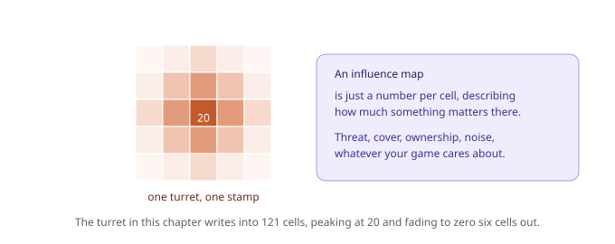
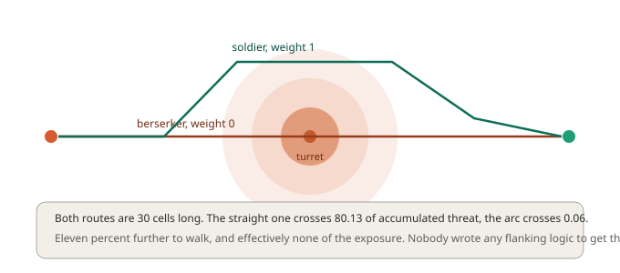
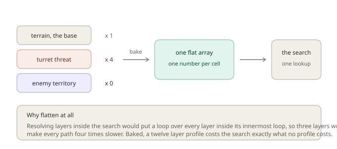
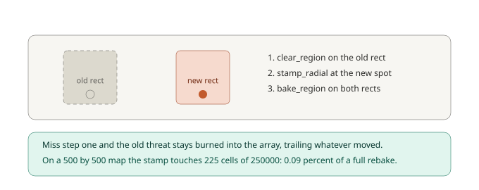

# Chapter 6: Making AI Look Smart, Layered Cost Fields

Chapter 2 gave you a swamp that cost eight times as much to cross, and the path found the bridge on its own. That was a hint at something much larger.

Terrain cost describes the *ground*. It's a property of the map, it's the same for everyone, and it doesn't change. But most of what makes AI look thoughtful isn't about the ground at all. It's about things that move, things that only some units care about, and things that are true right now and won't be in ten seconds.

An enemy that flanks instead of charging. A wounded unit that takes the long way home to stay off open ground. A scout that hugs cover while a berserker ignores it completely.

None of that needs new pathfinding. It needs the search to be given a different set of numbers, and this chapter is about producing those numbers cleanly.

## A number per cell

The idea is old and has a name: an **influence map**. You take something your game cares about, and you write a number into every cell describing how much it matters there.



Threat from a turret. Distance from cover. Which faction holds this ground. How much noise a cell makes. It's always the same shape of thing, one number per cell, and once you have it, the search can take it into account.

This chapter's battlefield is 32 by 20 with three ruins for cover and one turret covering the middle. The turret's threat is a single stamp, centred on cell (16,10), reaching 200 pixels with a peak of 20 and a quadratic falloff. It writes into **121 cells**.

```gml
grid = chapter6_build();

danger = gmnav_costlayer_create(grid, "turret");
gmnav_costlayer_stamp_radial(danger, _wx, _wy, 200, 20, 2);
```

A **layer** is exactly that: a value per cell, and nothing else. It knows nothing about the terrain, nothing about who's reading it, and nothing about other layers. That independence is the point, because it means you can author threat without thinking about territory, and territory without thinking about threat.

## Weights belong to the reader

Here's the design decision that makes layers useful rather than merely tidy.

The layer stores *how much threat exists*. It does **not** store how much any particular unit should care. That's a property of the unit, so it lives on a **profile**:

```gml
berserker = gmnav_costprofile_create(grid, "berserker");
gmnav_costprofile_add(berserker, danger, 0);      // does not care at all

soldier = gmnav_costprofile_create(grid, "soldier");
gmnav_costprofile_add(soldier, danger, 1);        // cares normally

scout = gmnav_costprofile_create(grid, "scout");
gmnav_costprofile_add(scout, danger, 4);          // cares a great deal
```

Three agent types, one shared danger map, three different opinions about it. When the turret moves you update one layer, and all three profiles pick up the change.

Pass a profile with the request:

```gml
gmnav_scheduler_request(sched, _from, _to, gmnav_priority.NORMAL, false, soldier);
```

### Watching them disagree

Same start, same goal, same map, straight across from (1,10) to (30,10):



- **Berserker, weight 0**: 30 cells, cost 30.656854, and it accumulates **80.13** of threat walking straight through the turret's field.
- **Soldier, weight 1**: 30 cells, cost 34.031202, threat accumulated **0.06**.

Read those together, because the numbers say something better than the picture does. **Both routes are 30 cells long.** The soldier's arc is eleven percent more expensive to walk and picks up essentially none of the exposure. That's not a compromise, it's close to a free lunch, and it exists because the map had a safe lane the soldier was willing to look for and the berserker wasn't.

You wrote no flanking logic. There is no "prefer cover" behaviour anywhere. There's a number per cell and a weight per unit type, and the arc came out of arithmetic.

Bump the scout to weight 4 and it stays wide on the return leg too, at cost 34.213121. Past a point, more caution buys nothing because there's no more danger to avoid, which is itself worth knowing when tuning.

## Stacking

Layers add. Give the right-hand side of the map to the enemy faction:

```gml
territory = chapter6_territory_layer(grid);

gmnav_costprofile_add(soldier, danger, 1);
gmnav_costprofile_add(soldier, territory, 1);
gmnav_costprofile_bake(soldier);
```

The same soldier now routes at cost **80.859355** instead of 34.031202, and takes a different route, because it's weighing two independent influences at once. Set the territory weight to 0 and you get the original route back exactly.

That's the compounding benefit. Each layer is authored once by whoever owns that concept, and every combination is a weight table.

## Baking, and why it exists

There's an obvious way to implement all this, and it's a trap.

You could resolve cost on demand: when the search asks what a cell costs, loop over the layers, multiply each by its weight, add them up. It works, it's simple, and it puts a loop over every layer **inside the innermost loop of A\***, which runs millions of times. A three-layer profile would make every path in your game roughly four times slower.

GMNav flattens instead:

```gml
gmnav_costprofile_bake(soldier);
```



Baking walks every cell once, combines the base terrain cost with each weighted layer, and writes the result into a single flat array. The search then does exactly one array lookup per neighbour, the same as it would with no profile at all.

**A twelve-layer profile costs the search precisely what no profile costs.** The work moved to bake time, where you control when it happens.

Profiles track whether they're out of date:

```gml
gmnav_costprofile_bake_if_dirty(soldier);
```

A profile goes dirty when any of its layers changes, when a weight changes, or when the grid's terrain changes. That last one catches a case people miss: block a wall or change a terrain cost, and every profile over that grid needs rebaking too.

## Threats that move

A full bake touches every cell, which on a large map is not a per-frame operation. But a turret that tracks the player, or a fire that spreads, needs updating constantly.

The answer is to rebake only the rectangle that changed. Every stamp returns the cell rect it touched, specifically so you can:



```gml
// last frame's footprint
gmnav_costlayer_clear_region(danger, _old[0], _old[1], _old[2], _old[3]);

// this frame's
var _new = gmnav_costlayer_stamp_radial(danger, player_x, player_y, 200, 20, 2);

// rebake both, the area vacated and the area newly covered
gmnav_costprofile_bake_region(soldier, _old[0], _old[1], _old[2], _old[3]);
gmnav_costprofile_bake_region(soldier, _new[0], _new[1], _new[2], _new[3]);

_old = _new;
```

**Both rectangles, always.** Skip the old one and the previous threat stays burned into the resolved array permanently, so your turret leaves a trail of phantom danger behind it that nothing ever clears.

The saving scales with map size, which is the point. On this chapter's small 32 by 20 map, the stamp's rect is 225 cells against 640 for a full bake, only a 65 percent saving. On a 500 by 500 map the same stamp is still 225 cells, now out of 250,000, so a moving threat costs **0.09 percent** of a full rebake. Region baking is the difference between influence maps being a nice idea and being something you can afford every frame.

One deliberate detail: `bake_region` does **not** clear the profile's dirty flag, because it only guarantees the rectangle you named. The rest of the map may still be stale, and pretending otherwise would hide bugs.

## Stamps combine with max, not with plus

Two overlapping stamps in the same layer take the **higher** value rather than adding.

That's deliberate and it matters. Two turrets covering the same cell make it dangerous, not twice as dangerous. Adding would mean a cluster of five guards produces a hazard five times worse than any of them individually, which grows without limit and quickly swamps every other layer in the profile.

It also makes stamping idempotent: re-stamping the same source at the same place changes nothing, so a missed clear doesn't compound frame after frame.

If you genuinely want additive behaviour, that's what separate layers are for. Layers add to each other, stamps within a layer don't.

## The floor, again

Chapter 2 established that a cell can never cost less than 1, and profiles enforce the same rule at bake time. A negative weight is a perfectly reasonable thing to write:

```gml
gmnav_costprofile_add(hunter, danger, -1);   // actively seeks the fight
```

and the resolved cost still clamps at 1, because a step cheaper than the heuristic assumes would silently break A\*'s optimality, exactly as it would from the terrain side.

So a negative weight doesn't make dangerous ground *attractive*, it makes it merely ordinary. To genuinely pull a unit toward something, raise the cost of everywhere else, or use a flow field aimed at the thing you want it to reach, which is Chapter 8.

## Seeing it

Cost fields are the subsystem where reading numbers helps least and looking helps most:

```gml
gmnav_debug_draw_costs(grid, soldier);   // pass the profile, not the grid alone
gmnav_debug_draw_grid(grid);
```

Passing the profile shows what that agent type actually pays, so you can flip between `berserker` and `scout` and watch the same map become two different worlds. Pass no profile and you see only base terrain, which is rarely the thing you're debugging.

## What you've learned

- **An influence map is one number per cell** describing how much something matters there. Threat, cover, ownership, noise, all the same shape.
- **Layers are authored independently** and know nothing about who reads them or what else exists.
- **Weights live on the profile, not the layer**, so three unit types share one danger map and disagree about it completely.
- **The behaviour comes out of arithmetic.** Two 30-cell routes across the same field, one accumulating 80.13 of threat and the other 0.06, with no flanking logic written anywhere.
- **Layers stack**: adding enemy territory took the same soldier from 34.03 to 80.86 and changed its route.
- **Baking flattens everything into one array** so the search does a single lookup, making a twelve-layer profile as cheap as none.
- **Region baking is what makes moving threats affordable**, dropping to 0.09 percent of a full rebake on a large map. Always rebake the old rect as well as the new one.
- **Stamps combine with max, layers combine with plus**, and resolved cost still clamps at 1.

## What's next

Every agent so far has been a point. A cell is either walkable or it isn't, and that answer is the same whether the thing walking is a rat or a siege golem four tiles wide.

Real games have both. A boss that squeezes through a one-tile doorway looks broken in a way players notice immediately, and the obvious fixes, separate grids per unit size, or hand-tagged "big units keep out" markers, get expensive and wrong fast.

In **Chapter 7** we'll solve it properly. You'll learn what clearance means precisely, how two linear passes compute it for an entire map faster than checking one agent by hand, how a single navigation grid serves every agent size at once, and the deliberate rule-bend that lets an agent already wedged in a tight spot path its way back out.

See you there.
