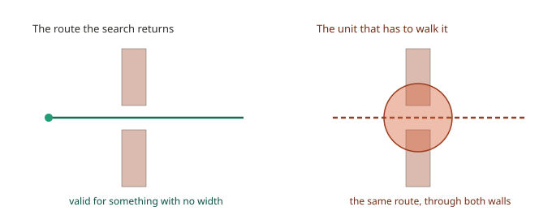
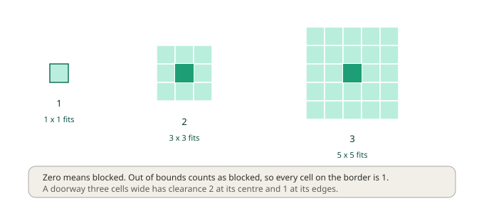
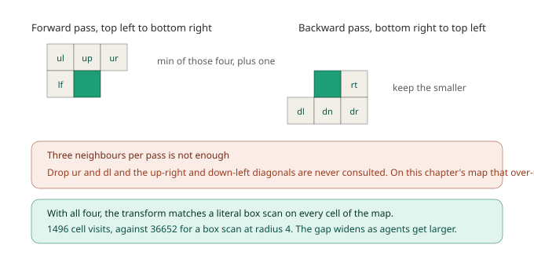
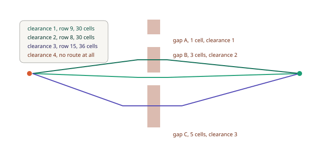

# Chapter 7: Size Matters, Clearance and Agent Radius

Every agent in this series so far has been a point.

A cell is walkable or it isn't, and the search gives the same answer whether the thing walking is a rat or a siege golem four tiles across. That's fine right up until your game has both, and then it fails in a way players spot instantly.



The route on the left is correct. The unit on the right is following it through two walls.

There are obvious fixes and they're all bad. A second navigation grid per unit size means duplicated maps to keep in sync. Hand-tagging cells as "large units keep out" means a designer maintaining that tagging forever, and getting it wrong every time the level changes. Making the grid finer so a big unit occupies several cells multiplies your cell count and does nothing about the actual question.

The real fix is to precompute, for every cell, **how much room there is around it**. That's clearance, and this chapter is about computing it cheaply and using it correctly.

## What clearance means, precisely

The definition is worth getting exact, because a vague version will mislead you later.

**A cell's clearance is the largest `r` for which every cell within Chebyshev distance `r - 1` is open.**



So 1 means a single cell fits, 2 means a 3 by 3 block fits, 3 means 5 by 5, and 0 means the cell is blocked. Out of bounds counts as blocked, which is why every cell along the map border is exactly 1.

The consequence worth internalising: a doorway three cells wide has clearance **2** at its centre and **1** at its edges. Width three does not mean clearance three. The value describes the room around a cell, not the width of the passage it sits in.

## A new map: the fortress

This chapter's map is 34 by 22, with one dividing wall pierced by three doorways of deliberately different widths, and a couple of pillars to make clearance vary elsewhere.

| Doorway | Width | Clearance at centre |
|---|---|---|
| gap A, row 3 | 1 cell | 1 |
| gap B, rows 7 to 9 | 3 cells | 2 |
| gap C, rows 13 to 17 | 5 cells | 3 |

```gml
grid = chapter7_build();
gmnav_clearance_build(grid);
```

That second call computes clearance for the entire map. How it does that is the interesting part.

## Computing it without checking every cell

The direct approach is to stand on each cell and expand a box outward until it hits something. It's correct, obvious, and unusable.

The cost is the problem. For radius `r` you check `(2r-1)²` cells, for every cell in the map. On our fortress at radius 4, that's **36,652 cell checks**. On a 500 by 500 map it's about 12 million, and it gets worse quadratically as units get bigger.

There's a much better way, and it's an old idea from image processing: a **distance transform** computed by two sweeps.



The forward sweep runs top-left to bottom-right. For each open cell, look at four already-computed neighbours, up-left, up, up-right and left, take the smallest, add one. Because those neighbours were computed earlier in the same pass, each already knows its distance from the nearest obstruction above or to the left, and adding one propagates that knowledge forward.

The backward sweep runs bottom-right to top-left doing the mirror image, and keeps whichever value is smaller.

Two passes, four lookups each. On our fortress that's **1,496 cell visits** against 36,652 for the box scan at radius 4, and unlike the box scan it doesn't care how large your units are. The cost is the same for radius 2 and radius 20.

I checked the result against a literal box scan on every cell of the map: **zero mismatches**.

### The mistake that hides

It's tempting to use three neighbours per pass rather than four. Up-left, up and left seems to cover "everything above and to the left", and the pattern is neater.

It doesn't work, and the way it fails is nasty. Drop the up-right neighbour from the forward pass and the down-left from the backward pass, and obstacles lying on those two diagonals are never consulted at all. On this chapter's map, the three-neighbour version gets **45 cells wrong**, and every error is in the dangerous direction: it reports cell (5,8) as clearance 2 when the truth is 1.

Over-reporting means a unit is told it fits somewhere it doesn't. It walks confidently into a wall, and every value near it looks perfectly plausible.

If you ever implement a distance transform yourself, test it against a brute-force scan. It's slow, it's twenty lines, and it's the only thing that reliably catches this.

## One grid, every size

With clearance built, you tell the search how much room a unit needs:

```gml
var _need = gmnav_clearance_for_radius(grid, agent.radius);

gmnav_scheduler_request(sched, _from, _to,
                        gmnav_priority.NORMAL, false, undefined, _need);
```

Use the conversion rather than guessing a cell count. It accounts for your tile size and uses the larger tile dimension, so a wide unit on tall thin tiles is never under-served.

Same map, same start and goal, four unit sizes:



| Unit | Needs | Result |
|---|---|---|
| rat | 1 | 30 cells, cost 29.828427, crosses at row 9 |
| soldier | 2 | 30 cells, cost 30.656854, crosses at row 8 |
| ogre | 3 | 36 cells, cost 37.485281, crosses at row 15 |
| golem | 4 | no route at all |

One navigation grid. One clearance map. Four different behaviours falling out of a single integer per request.

The ogre's detour is the interesting row. It can't use gap B at all, so it walks six extra cells down to gap C, at 202 settled cells against the soldier's 61. That's what a large unit should do, and you didn't write it.

The golem's failure is equally important. Nothing on this map fits it, so the search returns `FAILED` rather than a route it can't walk. **Design your levels knowing this**: if you have units needing clearance 4, some passage somewhere needs to be seven cells wide, and no amount of pathfinding will invent it for you.

## Getting out of a tight spot

Here's a problem that only shows up in a real game.

An ogre gets pushed into a one-cell doorway. A cutscene spawns it there. A wall collapses around it. Now every cell adjacent to it also has clearance 1, because they're all next to the same wall, so under a strict rule the ogre can never move again. It's not stuck by geometry, it's stuck by the rule.

GMNav relaxes the clearance requirement for the first couple of steps out of the start:

```gml
search.relax = 2;   // the default
```

Our ogre standing on cell (17,3), which has clearance 1 against its need of 3, escapes in 16 cells. Following the clearance values along its route:

```
1, 1, 2, 3, 4, ...
```

It steps through two under-clearance cells, both inside the relaxation window, then reaches a cell that genuinely fits and proceeds normally. Set `relax = 0` and the same request returns **no route**, permanently.

**The honest cost:** during those first steps the ogre will visibly clip geometry. That's a real trade, and it's the right one, because the alternative is a boss frozen in a doorway for the rest of the fight. If your game would rather fail loudly, `relax = 0` is there.

There's also a tidier option when it's the *goal* that's too tight. Rather than failing, relocate it:

```gml
var _to = gmnav_clearance_nearest(grid, _wanted_goal, _need);

if (_to != gmnav_no_node) {
    gmnav_scheduler_request(sched, _from, _to, gmnav_priority.NORMAL, false, undefined, _need);
}
```

This searches outward in rings for the closest cell that genuinely fits. "Walk as close as you can" is usually what the game meant anyway.

## Two details worth knowing

**Corner cutting checks clearance too.** Chapter 2 covered the diagonal squeeze between two wall corners. For a wide unit, a diagonal step also requires both flanking cells to fit it, not merely to be unblocked. Without that, a large unit clips the very corner the clearance map ruled out.

**Clearance goes stale.** Any change to the grid, blocking a cell, opening a door, invalidates it:

```gml
gmnav_clearance_build_if_stale(grid);
```

A search that needs clearance rebuilds automatically if it finds the map out of date, so you can't accidentally route a golem through a wall that appeared. But a rebuild is a full two-pass sweep, so if you're destroying terrain every frame, call it deliberately at a moment that suits you rather than letting a search trigger it mid-combat.

**Clearance is available on `ORTHO` and `ISO_DIAMOND` only.** On staggered and hex, a Chebyshev radius in cell indices doesn't correspond to a disc in world space, so the number would be meaningless. `gmnav_clearance_build` returns `false` on those layouts, and clearance requirements are then ignored rather than failing every request.

## Seeing it

```gml
gmnav_debug_draw_clearance(grid);
gmnav_debug_draw_grid(grid);
```

Brighter green is more room, darker is tighter. This is the overlay to reach for when a large unit refuses a route that looks perfectly passable to you, because the answer is almost always a doorway that's one cell narrower than you remembered.

## What you've learned

- **Pathfinding treats units as points**, and that breaks the moment your game has units of different sizes.
- **Clearance is the largest `r` where every cell within Chebyshev distance `r - 1` is open.** A three-wide doorway has clearance 2 at its centre, not 3.
- **Two linear sweeps compute it for the whole map**, 1,496 cell visits against 36,652 for a box scan at radius 4, and the cost doesn't grow with unit size.
- **Four neighbours per pass, not three.** Three leaves the up-right and down-left diagonals unconsulted, and gets 45 cells wrong on this map, always over-reporting.
- **One grid serves every size.** Four unit sizes, three doorways, four different outcomes from a single integer per request, including an honest failure for the unit nothing fits.
- **Relaxation lets a stuck unit escape**, at the cost of clipping geometry for its first couple of steps. `relax = 0` fails loudly instead.
- **`gmnav_clearance_nearest`** relocates a goal that's too tight rather than refusing the request.

## What's next

Everything so far runs one search per agent. The scheduler makes that affordable, but there's a scenario where it's the wrong shape of solution entirely.

Picture a thousand units in a tower defense, all walking toward the same exit. Every one of them runs its own search, over the same map, toward the same destination, computing very nearly the same answer. That's a thousand times more work than the problem actually requires.

In **Chapter 8** we'll turn the problem inside out. Instead of searching from each agent toward the goal, we build a distance field outward from the goal once, then let every agent read a direction straight out of it for free. You'll learn how the field is built and sliced across frames, how seeding several goals makes everyone flow to their own nearest exit in a single pass, and an honest account of when a flow field is precisely the wrong tool.

See you there.
