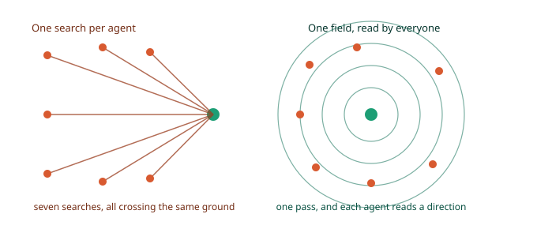
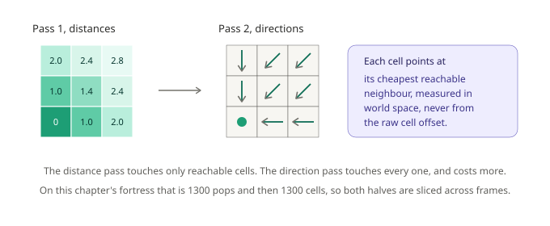
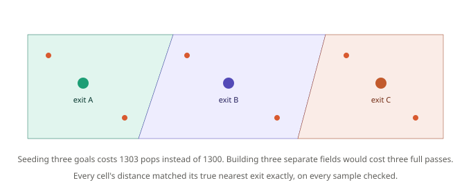
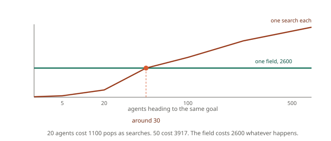

# Chapter 8: One Pass, Many Agents, Flow Fields

Chapter 3 made searches affordable by spreading them over time. But there's a situation where spreading the work is treating a symptom, because the work shouldn't exist in the first place.

Picture a siege. Two hundred attackers pour toward the same breach. Every one of them runs its own search, across the same map, toward the same destination, and computes very nearly the same answer as the two hundred beside it. The scheduler will keep your frame rate intact while it does, but it's still doing two hundred times more work than the problem needs.

This chapter turns the problem inside out.

## Stop searching toward the goal

Instead of searching from each agent *inward* to the goal, spread outward from the goal *once*, and record how far every cell in the map is from it.



Once you have that, an agent doesn't need to search at all. Standing on a cell, it looks at the neighbouring cells, finds the one with the lowest distance-to-goal, and steps there. Repeat, and it has walked an optimal route without ever running a search.

The structure that stores this is a **flow field**, and the numbers on this chapter's fortress make the case:

- One A\* from the muster point to the breach: cost 53.526912, **394 pops**.
- 500 agents each running their own: **34,707 pops**.
- One flow field covering the whole map: **1,300 pops** for the distances, plus 1,300 cells for the directions.

That's **13.3 times cheaper** than the 500 searches, and it doesn't get more expensive when the 501st agent arrives.

I also cross-checked it: for 120 randomly sampled cells, the distance the field reports and the cost A\* computes to the same goal agree to nine decimal places. **Zero disagreements.** The field isn't an approximation, it's the same answer computed in a different direction.

## Using one

```gml
grid  = chapter8_build();
field = gmnav_flowfield_create(grid);

gmnav_flowfield_build(field, gmnav_grid_node(grid, 44, 4));
```

Then, per agent, per frame:

```gml
var _d = gmnav_flowfield_sample(field, x, y);

x += _d[0] * spd;
y += _d[1] * spd;
```

That's the entire per-agent cost: one array lookup and a multiply. No ticket, no scheduler, no waiting.

Two other queries are useful:

```gml
gmnav_flowfield_cost_at(field, x, y)        // distance to goal, infinity if unreachable
gmnav_flowfield_is_reachable(field, x, y)   // can this cell get there at all
```

`cost_at` is more useful than it looks. It's a free "how far am I from the objective" for every unit on the map, which is exactly what you want for deciding who retreats, who reinforces, and which spawn point is closest to the action.

## What the build actually does

It's two passes, and knowing that explains the cost and the slicing.



**Pass one** is Dijkstra's algorithm from Chapter 2, run backwards from the goal with no heuristic at all. A heuristic biases a search toward one destination, and here we want *every* cell, so there's nothing to bias toward. This pass touches only reachable cells.

**Pass two** walks every cell and writes a direction: the vector pointing at whichever neighbour has the lowest distance. This is the expensive half, because it touches every cell in the grid, reachable or not, and does a neighbour scan on each.

On our fortress that's 1,300 pops then 1,300 cells. On a 500 by 500 map the second pass alone is 250,000 cells with an eight-neighbour scan each, which is why both halves can be sliced:

```gml
gmnav_flowfield_begin(field, _goal);

// then, once per frame
if (gmnav_flowfield_step(field, 2000) == gmnav_state.FOUND) {
    // ready to sample
}
```

`gmnav_flowfield_build` is the convenience version that runs both passes to completion, and it's the right choice at level load and the wrong one mid-combat.

### One detail that matters more on some maps than others

The direction stored in each cell is computed in **world space**, by converting both cells to pixel coordinates and subtracting, rather than from the raw cell offset.

On a square grid those give the same answer, so it looks like a pointless indirection. On isometric or hex it very much doesn't: a cell offset of `(1, 0)` is not a rightward move on screen, it's diagonal. Deriving the vector from the offset would send every agent in the wrong direction on any non-orthogonal layout, and the debug overlay would look entirely correct while it happened.

The vector pass also has to apply the same corner-cutting rule the search does. If it doesn't, a cell can end up pointing diagonally through a wall corner that the distance pass correctly refused to route through, and agents walk into it.

## Everyone to their own nearest exit

Here's the feature that costs nothing and looks like magic.

Seed the field with several goals instead of one, all at distance zero:

```gml
gmnav_flowfield_build(field, chapter8_exits(grid));   // an array of node ids
```



The distance recorded in each cell is now the distance to the *nearest* goal, and the direction points that way. Every agent flows to whichever exit is cheapest for **it**, and the map partitions itself into catchment areas along the natural watersheds.

Seeding three goals cost **1,303 pops** against 1,300 for one. Three separate fields would have cost three full passes and then needed per-agent logic to choose between them.

I verified the assignment on eight sampled cells against separately computed single-goal fields. Every one matched its true nearest exit exactly.

"Run to the nearest exit", "retreat to the closest friendly spawn", "route to whichever repair station is free" all become one pass and an array.

## Capping the build

An uncapped field expands over the entire reachable map, which is often more than you need. Enemies chasing the player only need directions within some radius of the player; beyond that they can idle, patrol, or fall back to A\*.

```gml
gmnav_flowfield_build(field, _goal, 25);   // stop expanding past cost 25
```

On this chapter's fortress:

| Cap | Pops | Coverage |
|---|---|---|
| none | 1,300 | 100% |
| 40 | 1,020 | 78% |
| 25 | 546 | 42% |
| 15 | 246 | 19% |

Capping at 25 does 42 percent of the work. On a large map the saving is far bigger, because a fixed radius covers a shrinking fraction of a growing map. If you rebuild a field every time the player moves, a cap is usually the difference between viable and not.

Cells outside the cap report `infinity` from `cost_at` and `false` from `is_reachable`, the same as genuinely unreachable ones, so your code needs no special case.

## When a flow field is the wrong tool

This is the honest part, and it matters because flow fields are easy to over-apply once they've impressed you.



**Below about thirty agents, individual searches are cheaper.** Measured on this map: 20 agents cost 1,100 pops as searches, 50 cost 3,917, and the field costs 2,600 whatever happens. With five agents you'd be paying nine times over for a field you barely use.

**Every agent must want the same destination.** A field answers one question, "which way to the nearest seeded goal". Fifty agents with fifty different destinations need fifty fields, which is worse than fifty searches.

**A moving goal means rebuilding.** If the goal is the player and the player never stops, you're rebuilding constantly. Sometimes that's fine, cap the distance and slice it. Sometimes A\* with a repath timer is genuinely cheaper.

**Per-agent cost profiles multiply the fields.** A field bakes in one profile. Chapter 6's berserker and scout disagree about danger, so they need separate fields. Three unit types with different weights means three builds, and the economics shift back toward searches.

The rule of thumb: **many agents, few destinations, stable goals**. Tower defense creeps, a fleeing crowd, an RTS move order, zombies converging on a player. Those are flow field problems. A dozen guards patrolling to a dozen different waypoints is not.

## Seeing it

```gml
gmnav_debug_draw_flowfield(field);
gmnav_debug_draw_grid(grid);
```

Every cell gets an arrow and a distance-shaded background, with a circle marking each goal. This is the overlay that catches a bad field instantly: **any arrow pointing into a wall means the field is wrong, not the steering**. It's also the fastest way to see catchment boundaries in a multi-goal field, since the watershed shows up as a visible seam where arrows change their minds.

## What you've learned

- **A flow field inverts the problem**: spread outward from the goal once, and every agent reads a direction instead of running a search.
- **It's exact, not approximate.** Field distances matched A\* costs on all 120 sampled cells to nine decimal places.
- **13.3 times cheaper than 500 searches** on this map, and unchanged in cost when more agents arrive.
- **Two passes**: a Dijkstra sweep over reachable cells, then a direction pass over every cell. The second is the expensive one, and both slice across frames.
- **Directions are computed in world space**, because on isometric and hex a cell offset is not a screen direction.
- **Multiple goals cost almost nothing**: three exits took 1,303 pops against 1,300, and every agent flows to its own nearest one.
- **Capping the build distance** cut coverage to 42 percent of the map for 42 percent of the work, and matters far more as maps grow.
- **The crossover is around thirty agents** on this map. Below that, use searches. Many agents, few destinations, stable goals is where a field belongs.

## What's next

Every map in this series has held still. Walls have been where they were at level load, and the path an agent received on frame 1 was still valid on frame 400.

Games are not like that. Doors close, bridges burn, a wall comes down under cannon fire, a player drops a barricade exactly where the guards were heading. When the world changes underneath a search that is already halfway through running, something has to give, and pretending otherwise produces enemies that walk confidently into geometry that appeared while they were thinking.

In **Chapter 9** we'll break the warehouse from Chapter 4 while agents are still crossing it. You'll learn how GMNav notices the world moved, why a suspended search can return a path straight through a wall and what the stale flag does and does not promise, and how the agent layer repairs itself without your code doing anything at all.

See you there.
