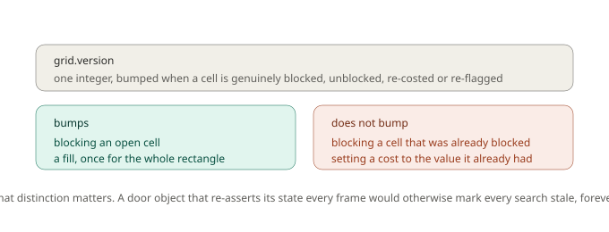
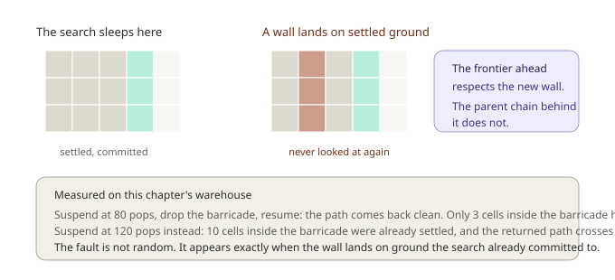
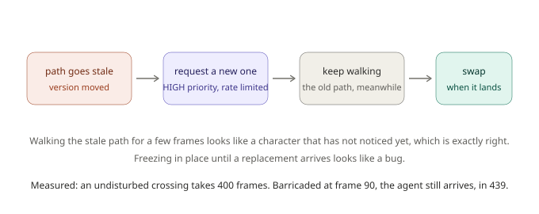

# Chapter 9: A World That Changes, Dynamic Obstacles and Replanning

Every map so far has held still. Walls were where they were at level load, and a path handed out on frame 1 was still valid on frame 400.

Games are not like that. Doors close. Bridges burn. A wall comes down under cannon fire. A player drops a barricade precisely where the guards were heading, because that's what players do.

This chapter breaks the warehouse from Chapter 4 while agents are still crossing it, and looks honestly at what survives that and what doesn't.

## Back to the warehouse

Same 30 by 20 map, same shelving, same patrol from (1,1) to (28,18). The baseline is 36 cells and 305 pops.

```gml
grid = chapter9_build();
```

Now we drop a barricade across the central corridor:

```gml
chapter9_drop_barricade(grid);   // blocks cells (12,7) to (15,12)
```

A search run **after** that edit handles it perfectly: 37 cells, 231 pops, zero blocked cells on the path. The route costs exactly one extra cell.

That's the easy case and it's most of them. The interesting question is what happens to searches that were already running.

## The version counter

GMNav tracks changes with a single integer on the grid.



Every search records the version it began under. Comparing later tells it whether the ground shifted:

```gml
if (gmnav_search_is_stale(search)) {
    // the world changed since this search started
}
```

The detail worth noticing is which edits *don't* bump it. Blocking a cell that was already blocked doesn't count. Setting a cost to the value it already had doesn't count. `gmnav_grid_fill_blocked` bumps once for the whole rectangle, not once per cell.

That matters more than it sounds. A door object that re-asserts its own state every step is a completely normal thing to write, and if every assertion bumped the version, every search in your game would be permanently stale and every agent would repath forever.

## A search that finished is safe

If a search completed before the edit, its path is a real path. It might no longer be a *good* one, it may now route through a wall that appeared, but it was correct when it was produced and nothing is corrupted.

```gml
gmnav_search_step(search, 100000);      // FOUND
gmnav_grid_set_blocked(grid, 13, 9, true);

gmnav_search_is_stale(search);          // true
gmnav_search_get_path(search);          // still returns the path
```

Stale means "this may no longer reflect the world", which is exactly the signal your game needs to decide whether to act on it.

## A search that was still running is not

Here's the honest part of this chapter, and it's the sharpest edge in the framework.

A suspended search has already committed. Cells it settled carry a cost and a parent link decided under the old world, and **settled cells are never revisited**. That's not an oversight, it's the property that makes A\* efficient. So a wall landing on ground the search has already crossed off is simply never noticed.



I measured exactly when this bites, and the answer is more precise than "sometimes":

| Suspended after | Cells settled inside the barricade zone | Result |
|---|---|---|
| 80 pops | 3 | path comes back clean |
| 120 pops | 10 | **path crosses 5 blocked cells** |

Below 80 pops the search simply hadn't reached that ground yet, so when it resumed it expanded into the barricade for the first time, saw the walls, and routed around them correctly. At 120 pops it had already settled ten cells in there under the old rules, and those commitments stood.

**The fault is not random.** It appears exactly when the change lands on ground the search already committed to. Which means a small budget makes it rarer and a big map makes it more likely, and neither of those is a fix.

### What the contract actually is

So be precise about what GMNav promises for an in-flight search when the world changes:

- It will **terminate**. It won't hang, loop, or corrupt its workspace.
- It will **report stale**.
- It does **not** promise the path is walkable.

That third line is why the stale flag is a correctness signal rather than a nice-to-have:

```gml
if (ticket.state == gmnav_state.FOUND && !ticket.stale) {
    // safe to follow
} else if (ticket.stale) {
    // request again, the world moved underneath this one
}
```

You might reasonably ask why GMNav doesn't just restart a search that notices the version moved. It's tempting, and it's a trap. In a tower defense where the player places a wall every second, or a destructible level under sustained fire, the version bumps constantly. A search that restarts on every bump never completes, burns the entire frame budget forever, and no agent ever receives a path. The failure mode of the cure is worse than the disease.

## The agent handles this for you

If you're using the agent layer, none of the above needs your attention.



The agent notices its path went stale, requests a replacement at `HIGH` priority, and **keeps walking the old path while it waits**. When the new one arrives it swaps.

That "keep walking" is a deliberate behavioural choice rather than laziness. A character that carries on for a few frames before reacting looks like a character who hasn't noticed the wall yet, which is exactly what a person would do. A character that freezes the instant the world changes looks like a bug.

Measured on the warehouse: an undisturbed crossing takes **400 frames**. Drop the barricade at frame 90, when the agent has reached cell (5,7), and it repaths to a 33-cell route and still arrives, in **439 frames total**, stopping 3.82 pixels from the goal. Thirty-nine extra frames for a wall that appeared in front of it.

Repathing is also rate limited:

```gml
agent.repath_gap = 20;   // frames between repath attempts
```

Without that, an agent standing next to a wall that keeps changing would request a new path every single frame and saturate the scheduler on its own.

## Everything derived also goes stale

The grid isn't the only thing that needs updating. Three other structures are computed *from* it, and all three become wrong when it changes.

**Clearance** must be rebuilt, since a new wall changes how much room its neighbours have:

```gml
gmnav_clearance_build_if_stale(grid);
```

A search that requires clearance rebuilds automatically if it finds the map out of date, so you can't accidentally route a large unit through a wall that appeared. But that rebuild is a full two-pass sweep, so if terrain is changing constantly, call it deliberately at a moment that suits you rather than letting it fire mid-combat.

**Cost profiles** go dirty too, because base terrain cost is part of what they bake:

```gml
gmnav_costprofile_bake_if_dirty(soldier);
```

**Flow fields** don't self-repair at all. A field built before an edit still describes the old world, arrows and all:

```gml
if (gmnav_flowfield_is_stale(field)) {
    gmnav_flowfield_begin(field, _goal);   // and slice it across frames
}
```

This is where flow fields earn their reputation for being awkward in destructible games. Rebuilding one is far more expensive than repathing a single agent, so a map that changes every few seconds shifts the economics from Chapter 8 back toward individual searches.

## Doors, and the cheap trick

The most common dynamic obstacle is a door, and doors have a property worth exploiting: they're usually open or closed rather than gradually changing.

```gml
function chapter9_set_door(_grid, _open) {
    var _before = _grid.version;
    gmnav_grid_fill_blocked(_grid, 13, 8, 13, 11, !_open);
    return (_grid.version != _before);
}
```

That returns whether anything actually changed, which lets a door object call it every step without consequence. If the state matches, the version doesn't move, nothing goes stale, and nothing repaths.

For a door that's *usually* open, there's a better option than blocking it. Leave it walkable and make it expensive:

```gml
gmnav_grid_set_cost(grid, 13, 9, 20);   // passable, but agents prefer not to
```

Now agents route around it when there's a reasonable alternative and go through it when there isn't, which is generally what you wanted, and it never makes anyone's destination unreachable. Blocking is the right call only when the door is genuinely impassable.

## When it genuinely can't be done

Sometimes the change makes the goal unreachable. Seal the warehouse completely and the search reports failure honestly, after 251 pops spent proving no route exists:

```gml
chapter9_seal(grid);   // full height barricade at column 13
// search returns gmnav_state.FAILED
```

The agent layer drops its goal on failure rather than retrying forever. That's a decision point your game has to own: wait, attack the barricade, pick a different objective. GMNav can tell you it's impossible, it can't tell you what to do about it.

## Seeing it

```gml
gmnav_debug_draw_grid(grid);
gmnav_debug_draw_agent(agent);
```

The agent overlay draws a stale path in **red** rather than yellow, so a glance tells you whether an agent is acting on current information or on something it's about to replace. Watching a red path linger for many frames means repathing is failing or being rate limited harder than you intended.

## What you've learned

- **One version counter** on the grid, bumped only by edits that genuinely change something, so re-asserting a door's state every frame costs nothing.
- **A completed search is safe.** Its path was correct when produced, and stale tells you it may no longer be current.
- **A suspended search is not.** Settled cells are never revisited, so a wall landing on committed ground goes unnoticed. Measured: suspend at 80 pops and the path is clean, at 120 pops it crosses 5 blocked cells.
- **The contract is termination plus the stale flag**, not path validity. Check `ticket.stale` before acting.
- **Restart-on-change would livelock** in exactly the games that need dynamic obstacles most, which is why GMNav doesn't do it.
- **The agent repairs itself**, keeps walking the old path while waiting, and still arrived in 439 frames against an undisturbed 400.
- **Clearance, cost profiles and flow fields all derive from the grid** and all go stale. The first two can self-heal, flow fields must be rebuilt explicitly.
- **An expensive door beats a blocked one** when the door is usually open, because it can never strand anybody.

## What's next

Everything in this series has assumed gravity doesn't exist. Cells connect to their neighbours because they're next to each other, and that assumption has quietly underpinned all nine chapters.

In a side-view game it's simply false. Two ledges can be touching on screen and completely unreachable from each other. Two ledges can be far apart and connected perfectly well, if your character can jump that far. Adjacency has nothing to do with it, and everything depends on how your character actually moves.

In **Chapter 10**, the last and hardest chapter, we build navigation for a platformer. GMNav works out which ledges connect by **simulating your character's real jump arcs against your real collision data**. You'll learn how to describe a movement model, why it must match your player controller exactly, how walk, fall and jump links are generated and priced in frames, why the resulting graph is one-way in places, and where GMNav stops and your character controller takes over. It closes with a full tour of the debug renderer.

See you there.
